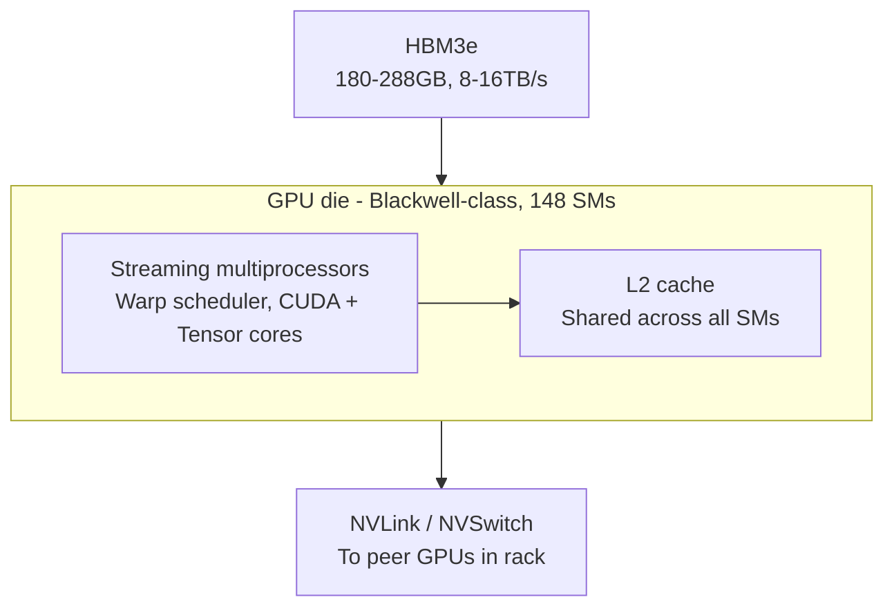
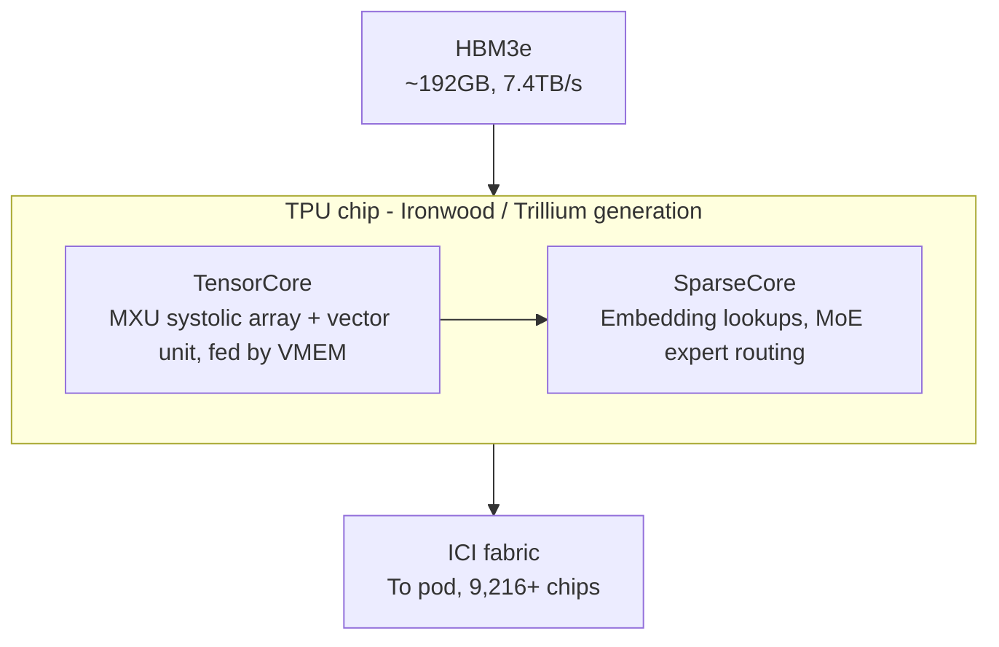
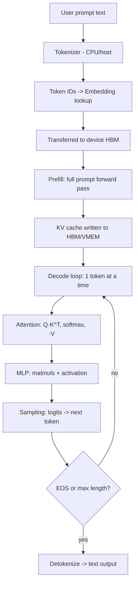

# GPU & TPU Architecture — Internal Operation for LLM Workloads (End-to-End)

*A staff-level reference: GPU and TPU microarchitecture, memory hierarchies, interconnects, the full path an LLM request takes through silicon, where other AI accelerators (Trainium, MI300X, Groq LPU, etc.) fit around them, realistic chip-configuration decisions from real LLM companies, and a GPU/TPU-scoped interview question bank.*

---

## 1. Why This Matters for LLM Systems

Every LLM forward pass is, at the hardware level, a sequence of **matrix multiplications** (`Q·K^T`, `softmax(...)·V`, `x·W`) plus elementwise ops (activations, layernorm, residuals) and memory movement. GPUs and TPUs are both built to accelerate exactly this pattern, but they get there via different design philosophies:

| | GPU (NVIDIA) | TPU (Google) |
|---|---|---|
| Core compute primitive | SIMT (Single Instruction, Multiple Threads) over many small cores | Systolic array (Matrix Multiply Unit) doing large fused matmuls |
| Programming model | General-purpose (CUDA); flexible kernels | Purpose-built for dense linear algebra via XLA compiler |
| Control | Hardware warp schedulers, dynamic | Software-scheduled, statically compiled dataflow |
| Caching | Hardware-managed L1/L2 caches | No general cache — explicit software-managed VMEM staging |
| Scale-out fabric | NVLink / NVSwitch (GPU-to-GPU), InfiniBand (node-to-node) | ICI — Inter-Chip Interconnect, a dedicated mesh/torus fabric |
| Best fit | Flexible workloads, mixed kernels, wide ecosystem | Massive, regular, dense/MoE matmul-heavy training & serving at extreme scale |

Both converge on the same goal: keep thousands of multiply-accumulate (MAC) units fed with data faster than memory would otherwise allow, because LLM inference and training are **memory-bandwidth-bound far more often than compute-bound**.

---

## 2. GPU Architecture (NVIDIA, Blackwell-generation as reference)

### 2.1 Hierarchy of Compute

```
GPU
 └─ GPCs (Graphics Processing Clusters) — e.g. 8 on a full Blackwell die
     └─ SMs (Streaming Multiprocessors) — e.g. 148–160 per GPU
         └─ Sub-partitions (4 per SM), each with:
             - Warp scheduler + dispatch unit
             - CUDA cores (INT32/FP32 ALUs) — 128 per SM
             - Tensor Cores (5th-gen) — 4 per SM
             - Tensor Memory (TMEM) — 256 KB per SM
             - Register file — 256 KB per SM
             - L1 cache / shared memory (unified, ~228 KB per SM)
     └─ L2 cache (shared across all SMs, several tens of MB)
 └─ HBM3e stacks (on-package, 8-Hi/12-Hi stacks) — 180–288 GB, ~8–16 TB/s
 └─ NVLink / NVSwitch fabric — GPU-to-GPU within a rack (e.g. NVL72: 72 GPUs, ~130 TB/s aggregate)
```



**Streaming Multiprocessor (SM)** is the fundamental compute engine. Each SM executes **warps** — groups of 32 threads that execute the same instruction in lockstep (SIMT). A warp scheduler picks ready warps each cycle and issues instructions to keep ALUs busy while other warps wait on memory — this is how GPUs hide memory latency: massive thread-level parallelism rather than large caches or out-of-order execution.

**Tensor Cores** are specialized units inside each SM dedicated to matrix multiply-accumulate at reduced precision (FP16/BF16/FP8/FP6/FP4). A single Tensor Core instruction multiplies small tile fragments (e.g. 16×8×16) of two matrices and accumulates into FP32, which is exactly the `A·B` operation that dominates attention and MLP layers. The 2nd-generation Transformer Engine automatically mixes precisions per-layer (e.g. FP8 for most of the network, higher precision where numerically sensitive) to preserve accuracy while maximizing throughput.

**Tensor Memory (TMEM)**, new in Blackwell, is a dedicated on-SM scratchpad for holding intermediate matmul accumulator results, reducing pressure on the register file during large GEMMs — important because LLM matmuls (hidden dims of 4K–16K+) produce large intermediate tiles.

### 2.2 Memory Hierarchy (fastest → slowest)

1. **Registers / TMEM** — per-thread/per-SM, sub-nanosecond access.
2. **Shared memory / L1** — per-SM, programmer- or compiler-managed scratchpad, ~20-30 TB/s aggregate.
3. **L2 cache** — shared across the whole GPU, tens of MB, caches weights/activations reused across SMs.
4. **HBM (High Bandwidth Memory)** — stacked DRAM on the same package as the GPU die, connected via a very wide (1024-bit+ per stack) interface. Holds model weights, KV cache, activations. Bandwidth is the single biggest predictor of LLM inference throughput.
5. **NVLink to peer GPUs** — when a model doesn't fit on one GPU (tensor/pipeline parallelism), activations and weight shards move over NVLink/NVSwitch at up to ~900 GB/s per GPU link, aggregating into terabytes/sec domain-wide.
6. **InfiniBand/Ethernet across nodes** — for multi-node clusters (data/pipeline parallelism across racks).

### 2.3 Execution Model

- Work is expressed as **kernels** (CUDA functions) launched across a **grid of thread blocks**.
- Thread blocks are scheduled onto SMs; each SM runs multiple blocks concurrently (occupancy), context-switching between warps for free to hide latency.
- The **CUDA/cuDNN/cuBLAS/TensorRT-LLM stack** decides how to tile a matmul, which Tensor Core instructions to issue, and how to pipeline loads from HBM → L2 → shared memory → registers so compute units are never starved.
- Modern inference engines (TensorRT-LLM, vLLM) fuse many small ops (QKV projection, RoPE, attention, softmax) into custom kernels (e.g. FlashAttention) specifically to avoid round-tripping intermediate activations through HBM — because HBM bandwidth, not FLOPs, is usually the bottleneck for LLMs.

---

## 3. TPU Architecture (Google, v6e "Trillium" / v7 "Ironwood" as reference)

### 3.1 Hierarchy of Compute

```
TPU chip
 └─ TensorCore(s) — 1-2 per chip depending on generation
     └─ MXU (Matrix Multiply Unit) — a systolic array, 256×256 in v6e/v7 (65,536 MACs/cycle)
     └─ Vector Unit (VPU) — elementwise ops (activations, normalization)
     └─ Scalar Unit — control flow, addressing
     └─ SparseCore(s) — dedicated units for embedding lookups / sparse ops (v7: e.g. 2 per chip)
 └─ VMEM — on-chip SRAM scratchpad feeding the MXU directly
 └─ HBM3e — 96-192 GB per chip depending on generation, ~7.4 TB/s bandwidth
 └─ ICI (Inter-Chip Interconnect) — dedicated fabric connecting chips into a Pod (e.g. 9,216 chips per Ironwood Pod)
```



**MXU (systolic array)** is the heart of a TPU. Unlike a GPU's many small Tensor Core instructions issued per-warp, a systolic array is a 2D grid of MAC cells wired so that data flows through the array cell-to-cell: weights are loaded and held stationary in the array, activations stream in from one edge, partial sums propagate and accumulate as they pass through, and results stream out the other edge. This means a single MXU instruction can perform an entire large matmul tile with very high arithmetic intensity and minimal instruction-issue overhead — extremely efficient for the fixed, regular matmul shapes of transformer layers, at the cost of flexibility (irregular or highly dynamic compute maps poorly onto a systolic array).

**VMEM** (vector memory) is a large on-chip SRAM buffer that stages activations and weight tiles right next to the MXU. Because TPUs have no general hardware cache, the **XLA compiler** is responsible for explicitly scheduling exactly which tensors sit in VMEM at which point in time (double-buffering, prefetching) — this is a compile-time decision rather than a runtime cache-eviction policy, which is why TPUs are described as **software-scheduled dataflow machines**.

**SparseCores**, introduced for recommendation/embedding workloads and now used in MoE serving, handle sparse gather/scatter operations (e.g. embedding table lookups, expert routing in Mixture-of-Experts models) without burning MXU cycles on non-matmul work.

### 3.2 Interconnect and Pod Scaling

TPUs are designed from the ground up to be used as a **Pod** — thousands of chips wired via a dedicated **ICI** mesh/torus network (not general Ethernet), giving very high, predictable bandwidth between neighboring chips and low-diameter routing across the whole pod. A Pod behaves logically like one giant accelerator with unified HBM addressable via collective operations, which is what lets XLA compile a single program that shards a huge model's weights and activations across the entire pod automatically (via SPMD partitioning).

### 3.3 Execution Model

- Programs are written in a high-level framework (JAX/TensorFlow/PyTorch-XLA) and compiled **ahead-of-time** by **XLA (Accelerated Linear Algebra)** into a static dataflow graph for the target TPU topology.
- XLA fuses operations, decides tiling, decides VMEM staging/prefetch schedules, and decides how to partition tensors across chips (data/tensor/pipeline/expert parallelism) — all at compile time, rather than at kernel-launch time as on a GPU.
- Because the schedule is static and known ahead of time, TPUs can achieve very high, predictable utilization on well-shaped, repeated workloads (like transformer training steps that repeat identically thousands of times) — but are less forgiving of highly dynamic control flow.

---

## 4. Other Processing Units Used in LLM Infrastructure

GPUs and TPUs cover the large majority of production LLM training and serving, but a real LLM infra stack touches several other kinds of silicon. This is the last hardware category this doc covers — from here on it goes back to being GPU/TPU-only.

| Chip class | Examples | Role in LLM infra |
|---|---|---|
| **CPU (host)** | Intel Xeon, AMD EPYC, Google Axion (ARM), NVIDIA Grace (ARM) | Every accelerator server has a host CPU: runs the OS, orchestrates job scheduling, does tokenization/detokenization, data loading and preprocessing, and issues the kernel launches / XLA programs to the accelerator. Never does the matmul-heavy work itself. |
| **Custom training/inference ASICs (non-Google)** | AWS Trainium2 (training) / Inferentia2 (inference), Microsoft Maia, Meta MTIA | Hyperscaler-built accelerators analogous in spirit to TPUs — purpose-built matmul engines with a dedicated compiler (e.g. AWS Neuron SDK) — used to reduce dependence on NVIDIA supply and lower cost-per-token for that company's own internal or cloud-customer workloads. |
| **Merchant AI accelerators** | AMD Instinct MI300X/MI325X/MI350X, Intel Gaudi 3 | GPU-adjacent alternatives to NVIDIA with large HBM capacity (MI300X ships with up to 192GB) — used where raw memory capacity per chip, price, or supply diversification matters more than CUDA-ecosystem lock-in. Programmed via ROCm (AMD) or an OpenXLA/PyTorch backend. |
| **Wafer-scale / dataflow accelerators** | Cerebras WSE-3, SambaNova SN40L, Groq LPU | Non-von-Neumann designs built specifically for very low-latency inference or extreme single-chip memory bandwidth (Groq's LPU keeps weights in on-chip SRAM only, trading capacity for extremely fast, deterministic token generation). Used selectively for latency-critical serving rather than general-purpose training. |
| **DPU / SmartNIC** | NVIDIA BlueField, AWS Nitro | Offloads networking, storage, and security processing from the host CPU so it doesn't steal cycles needed to keep the GPU/TPU fed — increasingly important at the collective-communication scale multi-thousand-chip training runs require. |
| **Storage/network fabric silicon** | InfiniBand HCAs, RoCE-capable Ethernet NICs, optical circuit switches (Google's OCS) | Not compute at all, but directly determines achievable cluster-wide bandwidth for checkpointing, data loading, and gradient/activation collectives — at large scale this is as much a bottleneck as any chip's FLOPs. |

The practical takeaway for an infra builder: CPUs orchestrate, DPUs/networking move data between chips, and GPUs/TPUs (or their AWS/AMD/Cerebras-class equivalents) do the actual matmul work — but GPU and TPU remain the two architectures that matter for the vast majority of frontier-model training and production LLM serving today, which is why the rest of this document focuses on them exclusively.

---

## 5. End-to-End: What Happens When You Send a Prompt to an LLM

This traces a single inference request from the user's input to the generated output token, noting what happens on CPU (host) vs GPU/TPU (device) at each stage. The flow is the same conceptually on both architectures; the notes call out where they diverge.



### Step-by-step

1. **Tokenization (host/CPU).** The prompt string is split into subword tokens (BPE/SentencePiece) and mapped to integer IDs. This happens on the CPU, not the accelerator.

2. **Host → device transfer.** Token IDs (a small tensor) are copied over PCIe (GPU) or the host-to-chip interconnect (TPU, via the Axion/Grace-class host CPU) into device memory.

3. **Embedding lookup.** Token IDs index into the embedding matrix (a large weight tensor already resident in HBM) to produce initial hidden-state vectors. On TPUs with MoE or huge vocabularies, this gather is often offloaded to the SparseCore; on GPUs it's a gather kernel.

4. **Prefill phase.** The full prompt (all tokens at once) is run through every transformer layer in one large, highly parallel batched forward pass:
   - **QKV projection**: hidden states × weight matrices → Query, Key, Value tensors (large matmul → Tensor Cores / MXU).
   - **Attention**: `softmax(QK^T / √d) · V`, computed per head. Modern kernels (FlashAttention-style) fuse this into a single pass that never materializes the full attention matrix in HBM — it's tiled and kept in on-chip SRAM/VMEM to avoid the HBM bandwidth cost of writing/reading the O(n²) score matrix.
   - **Output projection + residual + LayerNorm/RMSNorm.**
   - **MLP block**: two large matmuls with an activation (SwiGLU/GELU) in between — usually the single largest FLOP consumer in a transformer layer.
   - This repeats for every layer (e.g. 40-120+ layers in a frontier model).
   - Because prefill processes many tokens at once, it is typically **compute-bound** (the GPU/TPU's raw FLOPs are the limiting factor) — a good fit for large, dense matmuls on Tensor Cores/MXUs.

5. **KV cache population.** The Key and Value tensors computed for every prompt token, for every layer, are stored in HBM (and staged through VMEM/L2 as needed) as the **KV cache**, so they don't need to be recomputed for every subsequent generated token. KV cache size scales with `batch × sequence_length × layers × heads × head_dim`, and is often the dominant consumer of HBM capacity at long context lengths — this is why HBM *capacity* (192 GB on Ironwood, up to 288 GB on GB300) matters as much as bandwidth for serving.

6. **Decode phase (autoregressive loop).** For each new token:
   - Only the *single new token's* Q vector is computed and attended against the *cached* K/V for all previous tokens (no recomputation).
   - This step processes very little data per token, so it is typically **memory-bandwidth-bound**: the accelerator spends most of its time streaming the KV cache and weight matrices out of HBM rather than doing arithmetic. This is precisely why HBM bandwidth (7.4 TB/s on Ironwood, ~8-16 TB/s on Blackwell-class GPUs) is the primary lever for decode throughput/latency.
   - Techniques like **continuous batching** (vLLM, TensorRT-LLM) interleave the decode steps of many concurrent user requests so the accelerator's matmul units process a batch of single-token steps together, turning a bandwidth-bound single-request workload into a much more efficient batched one.
   - If the model is sharded across multiple chips (tensor parallelism), each decode step requires an **all-reduce** or **all-gather** collective over NVLink (GPU) or ICI (TPU) to combine partial results from each shard — this cross-chip communication is often the true bottleneck at large scale, not any single chip's compute.

7. **Sampling.** The final layer produces logits over the vocabulary; a sampling strategy (greedy, top-k, top-p, temperature) selects the next token ID — a small, cheap operation, sometimes done on host, often on-device to avoid a round trip.

8. **Loop or stop.** The new token is fed back as the next decode step's input until an end-of-sequence token or length limit is reached.

9. **Detokenization (host/CPU).** Token IDs are mapped back to text and streamed to the user.

### Training vs. Inference — what differs

- **Forward pass** is the same as prefill above, but run over full training batches.
- **Backward pass** computes gradients via backpropagation — roughly 2× the FLOPs of the forward pass — requiring activations from the forward pass to either be kept in HBM or recomputed (activation checkpointing, a common memory/compute tradeoff).
- **Optimizer step** (e.g. Adam) updates weights using gradients plus optimizer state (momentum, variance) — for large models this optimizer state itself can be several times the size of the weights, driving the use of sharded optimizers (ZeRO/FSDP) that split both weights and optimizer state across many chips.
- **Collectives dominate at scale**: gradient all-reduce across data-parallel replicas, activation/weight all-gathers for tensor/pipeline parallelism — this is why the interconnect (NVLink/InfiniBand or ICI) is often the actual limiter on large training-cluster efficiency, not any individual chip's peak FLOPs.

---

## 6. Why the Two Architectures Lead to Different System-Design Tradeoffs

- **GPU clusters** are built from a flexible fabric (NVLink within a rack, InfiniBand/Ethernet across racks) and a general-purpose software stack, so heterogeneous workloads (research experimentation, varied model architectures, custom kernels) are easier to support — at some efficiency cost from dynamic scheduling and general caches.
- **TPU pods** are built as a single tightly-coupled system from the start (ICI mesh, XLA static compilation across the whole pod), which yields very high, predictable efficiency on well-known, repeated, regular workloads like large-scale transformer pre-training and high-throughput serving — at the cost of needing workloads to fit the compiler's assumptions well (static shapes, regular dataflow).
- **Memory bandwidth vs. capacity vs. compute** is the recurring design axis: prefill/training is compute-bound (favor more/faster matmul units), decode/serving is bandwidth-bound (favor more HBM bandwidth and larger on-chip SRAM to keep the KV cache and weights streaming efficiently), and long-context serving is capacity-bound (favor larger HBM per chip to avoid excessive sharding).

---

## 7. Quick-Reference Glossary

| Term | Meaning |
|---|---|
| SM | Streaming Multiprocessor — GPU's core compute block |
| MXU | Matrix Multiply Unit — TPU's systolic-array compute block |
| Warp | Group of 32 GPU threads executing in lockstep (SIMT) |
| Tensor Core | GPU unit specialized for matmul at reduced precision |
| VMEM | TPU's on-chip SRAM scratchpad feeding the MXU |
| TMEM | GPU's on-SM scratchpad for matmul accumulator results (Blackwell+) |
| HBM | High Bandwidth Memory — stacked DRAM on-package |
| ICI | Inter-Chip Interconnect — TPU's dedicated pod-scale fabric |
| NVLink/NVSwitch | GPU-to-GPU high-bandwidth interconnect within a rack |
| XLA | Compiler that lowers JAX/TF/PyTorch graphs to TPU (and GPU) programs |
| KV cache | Stored Key/Value tensors from prior tokens, avoiding recomputation during decode |
| Prefill | Batched forward pass over the full input prompt (compute-bound) |
| Decode | Autoregressive one-token-at-a-time generation (bandwidth-bound) |
| Continuous batching | Serving technique that batches decode steps across concurrent requests |
| SPMD partitioning | Compiler-driven sharding of a single program across many chips |

---

## 8. Real-World Configuration Decisions

How companies actually choose chip type, chip count, and parallelism strategy for a given model and stage (training vs. serving). These reflect publicly disclosed practices as of 2026; a real decision also folds in cloud pricing, existing hardware commitments, and supply availability, which this simplifies for clarity.

### Example A — Pre-training a ~400B-parameter dense model (Meta, Llama 3.1 405B)

- **Hardware chosen**: 16,384 NVIDIA H100 80GB GPUs on a custom-built cluster (RDMA fabric, ~24,576 GPUs per physical cluster generation).
- **Why GPU over TPU here**: Meta's training stack (PyTorch, its own Grand Teton hardware platform) and internal tooling were already built around NVIDIA/CUDA; TPUs are a Google Cloud product, not something Meta can rack in its own datacenters at will.
- **Parallelism decision**: a dense (non-MoE) architecture was deliberately chosen over MoE partly to keep the distributed-training system simpler and more stable at this scale. A representative 3D-parallel configuration combines tensor parallelism (TP), pipeline parallelism (PP), context parallelism (CP, for long sequences), and data parallelism (DP) — e.g. TP=8, PP=9, CP=2, DP=4 on 512-GPU slices, composed up to the full cluster. TP is kept within a single NVLink-connected node (communication-heavy, needs the fastest link); PP and DP cross node boundaries (less frequent communication, tolerates InfiniBand latency).
- **Precision**: BF16 master weights with FP8 (via the Transformer Engine) for the compute-heavy matmuls, trading a small amount of numerical range for roughly 2x throughput on Tensor Cores.
- **Reliability engineering mattered as much as FLOPs**: at 16,384 GPUs the run saw a hardware fault roughly every 3 hours (GPUs and HBM3 accounted for about half of failures) — meaning checkpoint frequency and fast failure-recovery were first-order infra decisions, not an afterthought.

### Example B — Frontier-model pre-training and serving on TPU pods (Anthropic + Google Cloud, Claude on Ironwood)

- **Hardware chosen**: Google Cloud TPU v7 "Ironwood" pods, scaling toward roughly 1 million TPU chips and over a gigawatt of capacity committed for 2026, used for both training and serving Claude models.
- **Why TPU over GPU here**: at this scale, the deciding factors are typically (1) pod-level co-design — ICI mesh + XLA compilation across thousands of chips gives very predictable utilization on a workload (transformer pre-training) that is repeated identically for millions of steps; (2) capacity/availability — committing to a custom chip supply chain (Broadcom-designed Ironwood) diversifies away from GPU supply constraints; (3) cost-per-FLOP at guaranteed multi-gigawatt scale, negotiated directly with the chip's cloud provider rather than bought at spot/on-demand GPU pricing.
- **Practical implication for infra builders**: this is a training-and-serving decision made at the scale of an entire company's compute footprint, not a per-project chip pick — it only makes sense once you're committing to a specific cloud provider's custom-silicon roadmap for years, in exchange for cost and supply guarantees a general GPU market can't offer at that volume.

### Example C — Serving a 70B-parameter model in production (typical industry pattern, e.g. Llama-3-70B-class deployment)

- **Memory math first**: 70B params at FP16/BF16 ≈ 140GB of weights alone — doesn't fit on a single 80GB H100/A100, so the first decision is tensor parallelism across at least 2 GPUs (TP=2), or quantization.
- **Two common configurations**:
  - **Latency-optimized**: TP=4 or TP=8 across NVLink-connected H100s/B200s, FP8 weights — spreads both weights and KV cache thin per GPU, minimizing per-token latency for interactive chat use cases. More GPUs per replica = higher cost per request but faster response.
  - **Cost-optimized / high-throughput**: single GPU (or TP=2) with 4-bit quantization (AWQ/GPTQ, ~40-45GB for weights), paired with continuous batching (vLLM/TensorRT-LLM) to pack many concurrent users' decode steps together — accepts slightly higher per-request latency in exchange for far more requests served per GPU-hour, the typical choice for high-volume API or batch workloads.
- **KV cache is budgeted explicitly, not left to chance**: e.g. serving 32K-token context for 50 concurrent users can require 60GB+ of KV cache on top of the weights — this is sized deliberately (`--max-model-len`, `--gpu-memory-utilization` in vLLM) rather than left at framework defaults, because under-provisioning causes OOM crashes under load and over-provisioning wastes GPU-hours.
- **TPU-side equivalent**: the same tradeoff exists as TPU v5e (cheaper, higher throughput-per-dollar, used for cost-sensitive high-volume inference) vs. TPU v7/Ironwood or GPU B200-class hardware (used for large models or latency-sensitive serving) — smaller/cheaper chips for throughput-bound batch serving, larger/faster chips for latency-bound interactive serving.

### Decision framework distilled

| Question | Points toward |
|---|---|
| Does the workload run once at massive scale for years (frontier pre-training)? | TPU pod (if on Google Cloud) or a large custom GPU cluster — either way, negotiate supply/cost at the infra level, not per-project |
| Does the team's stack, tooling, and existing checkpoints assume CUDA? | GPU — switching compiler/runtime stacks (XLA vs. CUDA) has real engineering cost |
| Is the deployment latency-sensitive (interactive chat, agents)? | More chips per replica (higher TP), less quantization, prioritize HBM bandwidth |
| Is the deployment throughput-sensitive (batch jobs, high-volume cheap API tier)? | Fewer/cheaper chips per replica, more aggressive quantization, maximize continuous-batching concurrency |
| Does the model or context length blow past single-chip HBM capacity? | Tensor/pipeline parallelism is mandatory regardless of chip choice — this becomes a networking (NVLink/ICI) decision as much as a chip decision |

---

## 9. Interview Questions — Scoped to GPU & TPU (Machine Learning / Systems)

These are hardware-focused questions an ML systems, infra, or staff-level interview might ask — deliberately scoped to GPU/TPU internals and LLM workload behavior, not general ML theory.

**Fundamentals**

1. *What is the fundamental architectural difference between how a GPU and a TPU execute a matrix multiplication?*
   GPU: many small Tensor Core instructions issued per-warp across SMs, hardware-scheduled, with weights and activations both flowing through registers/caches. TPU: a systolic array (MXU) holds weights stationary while activations stream through and partial sums accumulate cell-to-cell — a single instruction covers a large matmul tile with a statically compiled schedule (XLA), not per-instruction hardware scheduling.

2. *Why are GPUs organized around warps of 32 threads, and what problem does that solve?*
   SIMT lets one instruction stream drive many ALUs at once; the warp scheduler swaps in other ready warps while one warp stalls on a memory access, hiding latency through massive thread-level parallelism instead of large caches or out-of-order execution.

3. *Why does a TPU have no general-purpose cache?*
   Because the compiler (XLA) knows the full dataflow graph ahead of time and can explicitly stage exactly the right data into VMEM before it's needed — a hardware cache's speculative, runtime eviction policy is redundant (and slower) when the schedule is already known statically.

**Memory & bandwidth**

4. *Why is LLM decode typically memory-bandwidth-bound rather than compute-bound, and what follows from that?*
   Each decode step processes only one new token per sequence, so very little arithmetic happens relative to the amount of weight/KV-cache data that must stream from HBM. Consequence: raw FLOPs matter less than HBM bandwidth for decode throughput, and techniques like continuous batching exist specifically to convert many small bandwidth-bound requests into fewer, better-utilized batched ones.

5. *Why is prefill compute-bound while decode is bandwidth-bound?*
   Prefill processes every prompt token in parallel through the same weights in one pass — high arithmetic intensity per byte loaded from HBM. Decode processes one token at a time against the same weights — low arithmetic intensity per byte loaded, since the large KV cache and weight matrices must still be streamed for a tiny amount of compute.

6. *What is the KV cache, and why does its size matter for serving?*
   Cached Key/Value tensors for every previous token/layer/head, avoiding recomputation each decode step. Its size scales with batch × sequence length × layers × heads × head_dim, and at long context lengths it can rival or exceed the model weights in HBM footprint — meaning HBM capacity, not just bandwidth, limits how many concurrent long-context requests a chip can serve.

7. *Why would you choose a chip with more HBM bandwidth vs. one with more HBM capacity?*
   More bandwidth speeds up decode/serving latency and throughput once the model already fits; more capacity lets you hold a bigger model or longer KV cache on fewer chips, reducing the need for cross-chip communication (tensor/pipeline parallelism) that adds its own latency and complexity.

**Parallelism & scaling**

8. *When would you use tensor parallelism vs. pipeline parallelism vs. data parallelism, and why does tensor parallelism typically stay within a node?*
   Tensor parallelism splits individual matmuls across chips and requires frequent, latency-sensitive collectives (all-reduce/all-gather) — it needs the fastest possible link (NVLink/ICI), so it's usually confined to chips within one high-bandwidth domain. Pipeline parallelism splits layers across chips (less frequent communication, tolerates higher latency, so it can cross nodes). Data parallelism replicates the whole model and only synchronizes gradients periodically — the most network-tolerant of the three, used to scale across the most nodes.

9. *At very large chip counts, what usually becomes the actual bottleneck — chip compute or the interconnect?*
   The interconnect. Gradient/activation collectives (all-reduce, all-gather) scale with chip count and often dominate wall-clock training time well before any individual chip's peak FLOPs are saturated — which is why interconnect design (NVLink/NVSwitch/InfiniBand, or ICI) is treated as a first-class infra decision, not an afterthought.

10. *Why does a systolic array (TPU MXU) handle irregular or dynamic computation worse than a GPU does?*
    A systolic array's efficiency comes from a fixed, regular dataflow pattern compiled ahead of time; workloads with data-dependent branching, variable shapes, or highly irregular sparsity don't map cleanly onto a static pipeline, whereas a GPU's per-warp hardware scheduling can adapt at runtime, at some cost to peak efficiency on regular workloads.

**Precision & throughput**

11. *Why do modern accelerators support FP8/FP4 precision for LLM workloads, and what's the tradeoff?*
    Lower precision means smaller data movement (helping the bandwidth-bound decode case) and higher matmul throughput per Tensor Core/MXU cycle. Tradeoff is numerical range/precision loss, which is why frameworks like NVIDIA's Transformer Engine mix precisions per-layer rather than using the lowest precision everywhere.

12. *What does quantizing a model's weights (e.g. to 4-bit) actually save at inference time, and what does it not fix?*
    It shrinks the weight footprint in HBM (e.g. ~140GB → ~40-45GB for a 70B model), letting it fit on fewer/cheaper chips and reducing bandwidth needed to stream weights each decode step. It does not shrink the KV cache, which is usually stored at higher precision and scales independently with context length and concurrency.

**Decision-making / system design**

13. *Given a 70B-parameter model and a latency-sensitive chat product, how would you decide chip count and precision?*
    Start from the memory budget (weights + KV cache at target context length and concurrency) to find the minimum chip count; then decide whether that leaves bandwidth headroom for target latency — if not, add more chips via tensor parallelism (within a node, NVLink-connected) rather than quantizing further, since latency-sensitive products usually value response speed over squeezing onto fewer chips.

14. *Why might a company choose to build/rent TPU pods for training but still serve on GPUs (or vice versa)?*
    Training benefits most from a tightly co-designed, statically scheduled system running the same workload repeatedly for weeks (TPU pod's strength). Serving often needs to support many different model variants, dynamic batching, and rapid deployment iteration, which benefits from the more flexible general-purpose GPU/CUDA ecosystem and tooling — the two stages have different tolerance for the "regular, static workload" assumption TPUs are optimized for.

15. *A training run at 16,000+ GPUs sees a hardware failure every few hours. How does that change the infra design compared to a 100-GPU job?*
    At that failure rate, checkpointing frequency, fast fault detection, and the ability to resume a large synchronous job without restarting from scratch become first-order design requirements — not because any single chip is unreliable, but because failure probability compounds with chip count in a tightly synchronized (all-reduce-style) training job.

---

*Sources reflect publicly available specifications and disclosed infrastructure practices as of 2026 (NVIDIA Blackwell/Blackwell Ultra generation; Google TPU v6e "Trillium" and v7 "Ironwood" generations; Meta's published Llama 3.1 405B training report; Anthropic/Google Cloud's disclosed TPU commitment). Exact figures vary by SKU, cluster generation, and are approximate.*
