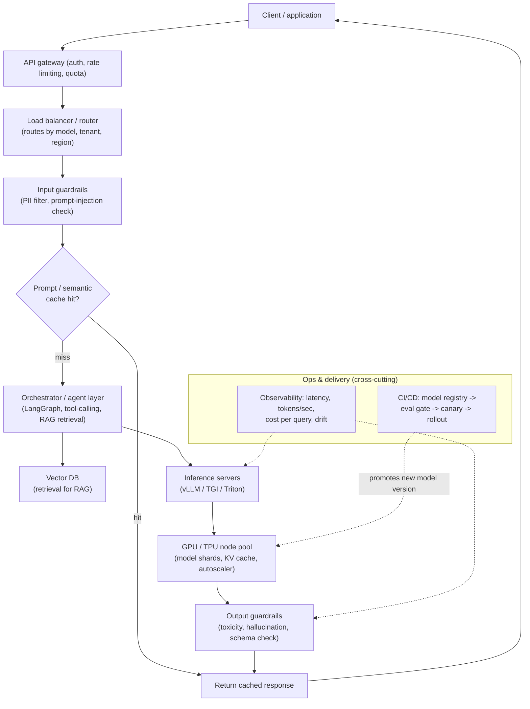

# GenAI Mastery Roadmap — Basics to Expert
### A complete, resource-backed path + Deployment Architecture + Staff/Principal-level (10+ YOE) interview prep

---

## How to use this doc
- Each phase has: **what to learn → why it matters → best free resources (clickable) → a checkpoint project**.
- Phases 0–4 = foundations. Phases 5–9 = core GenAI engineering. Phases 10–11 = expert/research frontier.
- You've already built RAG systems, LoRA/QLoRA fine-tunes, a from-scratch TinyGPT, and a LangGraph agent — treat those phases as **review + gap-filling**, and jump to the linked papers/advanced resources where you're already hands-on.
- A full **deployment architecture, CI/CD, and GPU/TPU scaling-math section** is included after the roadmap phases, before the interview questions.

---

## Phase 0 — Prerequisites (skip what you already know)

| Topic | Resource |
|---|---|
| Linear algebra intuition | [3Blue1Brown — Essence of Linear Algebra](https://www.youtube.com/playlist?list=PLZHQObOWTQDPD3MizzM2xVFitgF8hE_ab) |
| Probability & stats for ML | [StatQuest with Josh Starmer](https://www.youtube.com/@statquest) |
| Calculus/backprop intuition | [3Blue1Brown — Neural Networks](https://www.youtube.com/playlist?list=PLZHQObOWTQDNU6R1_67000Dx_ZCJB-3pi) |
| Classical ML | Already covered in your prior codelabs |

**Checkpoint:** Explain gradient descent, softmax, and cross-entropy loss from first principles without notes.

---

## Phase 1 — Deep Learning & NLP Foundations

**Learn:** feedforward nets, backprop, embeddings, RNN/LSTM/GRU limitations, why attention was invented.

**Resources:**
- [Andrej Karpathy — "Neural Networks: Zero to Hero"](https://karpathy.ai/zero-to-hero.html) (also on [YouTube](https://www.youtube.com/playlist?list=PLAqhIrjkxbuWI23v9cThsA9GvCAUhRvKZ)) — build micrograd, a bigram model, and a char-level transformer by hand
- [Stanford CS224N: NLP with Deep Learning](https://web.stanford.edu/class/cs224n/) — free lectures + assignments
- [Chris Olah — "Understanding LSTM Networks"](https://colah.github.io/posts/2015-08-Understanding-LSTMs/)

**Checkpoint:** You've already built a from-scratch BiGRU and TinyGPT — you're ahead here.

---

## Phase 2 — The Transformer, Deeply

**Learn:** self-attention, multi-head attention, positional encoding (absolute, RoPE, ALiBi), layer norm placement, residual streams.

**Resources:**
- Paper: ["Attention Is All You Need"](https://arxiv.org/abs/1706.03762) — read fully
- [Jay Alammar — "The Illustrated Transformer"](https://jalammar.github.io/illustrated-transformer/)
- [Karpathy — "Let's build GPT: from scratch, in code, spelled out"](https://www.youtube.com/watch?v=kCc8FmEb1nY)
- [Stanford CS25: Transformers United](https://web.stanford.edu/class/cs25/) ([YouTube playlist](https://www.youtube.com/playlist?list=PLoROMvodv4rNiJRchCzutFw5ItR_Z27CM))

**Checkpoint:** Explain KV caching, why attention is O(n²), and what RoPE solves that absolute positional encoding doesn't.

---

## Phase 3 — LLM Fundamentals: Pretraining, Tokenization, Scaling

**Learn:** BPE/SentencePiece tokenization, pretraining objectives, scaling laws, data curation, mixture-of-experts (MoE).

**Resources:**
- Paper: ["Scaling Laws for Neural Language Models"](https://arxiv.org/abs/2001.08361) and the [Chinchilla paper](https://arxiv.org/abs/2203.15556)
- [Hugging Face NLP Course](https://huggingface.co/learn/nlp-course)
- [Karpathy — "Let's build the GPT Tokenizer"](https://www.youtube.com/watch?v=zduSFxRajkE)
- [Sebastian Raschka's blog](https://sebastianraschka.com/blog/) — LLM architecture comparisons, MoE deep dives

**Checkpoint:** Explain Chinchilla-optimal training and how MoE reduces inference cost vs. an equal-parameter dense model.

---

## Phase 4 — Prompt Engineering & In-Context Learning

**Learn:** zero/few-shot prompting, chain-of-thought, ReAct, structured output/function calling, prompt injection risks.

**Resources:**
- [Prompt Engineering Guide](https://www.promptingguide.ai/)
- [Anthropic's prompt engineering docs](https://docs.claude.com/en/docs/build-with-claude/prompt-engineering/overview)
- Paper: ["Chain-of-Thought Prompting Elicits Reasoning"](https://arxiv.org/abs/2201.11903)
- Paper: ["ReAct: Synergizing Reasoning and Acting in Language Models"](https://arxiv.org/abs/2210.03629)

**Checkpoint:** Write a robust structured-extraction prompt with few-shot examples; know when CoT helps vs. just adds latency/cost.

---

## Phase 5 — Retrieval-Augmented Generation (RAG)

**Learn:** embeddings & vector search (HNSW, IVF), chunking, hybrid search (BM25 + dense), re-ranking, GraphRAG, evaluation.

**Resources:**
- [LangChain RAG tutorials](https://python.langchain.com/)
- [LlamaIndex — Advanced RAG guides](https://docs.llamaindex.ai/)
- [Pinecone Learning Center](https://www.pinecone.io/learn/)
- Paper: ["Retrieval-Augmented Generation for Knowledge-Intensive NLP Tasks"](https://arxiv.org/abs/2005.11401)
- [RAGAS docs](https://docs.ragas.io/)

**Checkpoint:** You've built this end-to-end. Go deeper into hybrid search + cross-encoder re-ranking and GraphRAG — the gap between "RAG demo" and production RAG.

---

## Phase 6 — Fine-Tuning & Alignment

**Learn:** full fine-tuning vs PEFT, LoRA/QLoRA math, instruction tuning (SFT), RLHF, DPO/ORPO/KTO, reward hacking, catastrophic forgetting.

**Resources:**
- Paper: ["LoRA: Low-Rank Adaptation of Large Language Models"](https://arxiv.org/abs/2106.09685)
- Paper: ["QLoRA: Efficient Finetuning of Quantized LLMs"](https://arxiv.org/abs/2305.14314)
- Paper: ["Direct Preference Optimization"](https://arxiv.org/abs/2305.18290)
- [Hugging Face TRL docs](https://huggingface.co/docs/trl) (SFT/DPO/PPO trainers)
- [HF blog — "Illustrating RLHF"](https://huggingface.co/blog/rlhf)

**Checkpoint:** You're strong here already — focus on articulating when full RLHF (PPO) still beats DPO despite the complexity.

---

## Phase 7 — Agents & Orchestration

**Learn:** tool-calling, ReAct loops, multi-agent patterns, planning vs reactive agents, memory, orchestration framework tradeoffs.

**Resources:**
- [LangGraph docs](https://langchain-ai.github.io/langgraph/) — go through the multi-agent tutorials
- [CrewAI docs](https://docs.crewai.com/) and [AutoGen docs](https://microsoft.github.io/autogen/)
- [Anthropic — "Building Effective Agents"](https://www.anthropic.com/research/building-effective-agents) — best practical write-up on agents vs. simple pipelines

**Checkpoint:** Articulate, from real experience, when a DAG/workflow beats a fully autonomous agent (reliability, cost, debuggability).

---

## Phase 8 — Evaluation, Safety & Guardrails

**Learn:** LLM-as-judge evaluation, hallucination detection, red-teaming, jailbreak/prompt-injection defenses, PII leakage prevention, output guardrails.

**Resources:**
- [DeepEval docs](https://docs.confident-ai.com/) and [RAGAS docs](https://docs.ragas.io/)
- [Guardrails AI docs](https://www.guardrailsai.com/docs) and [NeMo Guardrails](https://github.com/NVIDIA/NeMo-Guardrails)
- Paper: ["Universal and Transferable Adversarial Attacks on Aligned Language Models"](https://arxiv.org/abs/2307.15043)
- [OWASP Top 10 for LLM Applications](https://owasp.org/www-project-top-10-for-large-language-model-applications/)

**Checkpoint:** Design a defense-in-depth guardrail stack and name at least 3 real attack classes.

---

## Phase 9 — LLM Deployment, Inference Optimization & MLOps

**Learn:** quantization, KV-cache optimization, continuous batching, speculative decoding, serving frameworks, cost/latency tradeoffs.

**Resources:**
- [vLLM docs](https://docs.vllm.ai/) + paper: ["Efficient Memory Management for LLM Serving with PagedAttention"](https://arxiv.org/abs/2309.06180)
- [Hugging Face Text Generation Inference (TGI) docs](https://huggingface.co/docs/text-generation-inference)
- Paper: ["Fast Inference from Transformers via Speculative Decoding"](https://arxiv.org/abs/2211.17192)
- [Chip Huyen's blog](https://huyenchip.com/blog/) — practitioner-grade LLM system design and evals

**Checkpoint:** See the full Deployment Architecture & Scaling Math section below and benchmark vLLM vs. plain HF `transformers` serving yourself.

---

## Phase 10 — Multimodal & Adjacent GenAI

**Learn:** diffusion models, text-to-image pipelines, vision-language models (CLIP, LLaVA-style), audio/speech generation.

**Resources:**
- [Hugging Face Diffusers course](https://huggingface.co/learn/diffusion-course)
- Paper: ["Denoising Diffusion Probabilistic Models"](https://arxiv.org/abs/2006.11239)
- Paper: ["Learning Transferable Visual Models From Natural Language Supervision" (CLIP)](https://arxiv.org/abs/2103.00020)
- [Jay Alammar — Illustrated Stable Diffusion](https://jalammar.github.io/illustrated-stable-diffusion/)

**Checkpoint:** Explain how a diffusion model's training objective differs from an autoregressive LLM's.

---

## Phase 11 — Expert / Research Frontier (ongoing)

**Learn:** distributed training (data/tensor/pipeline parallelism, ZeRO), long-context architectures, mechanistic interpretability, constitutional AI/RLAIF, state-space models.

**Resources:**
- [Google DeepMind — "How to Scale Your Model"](https://jax-ml.github.io/scaling-book/) — free online book on LLM training at scale
- Paper: ["ZeRO: Memory Optimizations Toward Training Trillion Parameter Models"](https://arxiv.org/abs/1910.02054)
- Paper: ["Constitutional AI"](https://arxiv.org/abs/2212.08073)
- [Anthropic interpretability research](https://transformer-circuits.pub/) — the best public mech-interp resource
- Paper: ["Mamba: Linear-Time Sequence Modeling with Selective State Spaces"](https://arxiv.org/abs/2312.00752)

**Checkpoint:** Hold a technical conversation about why training a frontier model requires 3D parallelism.

---

# GenAI Deployment: Architecture, Configurations, CI/CD & Scaling Math

## 1. Reference architecture — all the building blocks

**Building blocks, one by one:**
- **API gateway** — auth (API keys/OAuth), per-tenant rate limiting, request validation.
- **Load balancer / router** — routes to the correct model/version; can do traffic-splitting for A/B or canary.
- **Guardrails (input + output)** — PII/prompt-injection filtering on the way in; toxicity/hallucination/schema validation on the way out. See [Guardrails AI](https://www.guardrailsai.com/docs) / [NeMo Guardrails](https://github.com/NVIDIA/NeMo-Guardrails).
- **Cache layer** — exact-match or semantic (embedding-similarity) cache in front of the model to cut cost/latency for repeated queries.
- **Orchestrator / agent layer** — decides whether to retrieve, call a tool, or go straight to generation ([LangGraph docs](https://langchain-ai.github.io/langgraph/)).
- **Vector DB** — retrieval backend for RAG (Chroma, Qdrant, Weaviate, pgvector, Pinecone).
- **Inference servers** — the serving engine (vLLM, TGI, Triton) that implements continuous batching, PagedAttention/KV-cache management.
- **GPU/TPU node pool** — where model weights actually live; autoscaled based on queue depth/latency SLOs.
- **Observability** — latency percentiles, tokens/sec, cost per query, output-quality drift, guardrail trigger rates.
- **CI/CD + model registry** — versions models, gates promotion on eval scores, controls rollout strategy.

## 2. Deployment configurations — which one, when

| Configuration | What it is | Best for | Tradeoff |
|---|---|---|---|
| **Managed API** (OpenAI/Anthropic/Vertex/Bedrock) | No infra — call a hosted endpoint | Fastest time-to-market, unpredictable/low traffic, no in-house MLOps | Pay-per-token, less control over latency/data residency, vendor lock-in |
| **Serverless GPU** (Modal, RunPod Serverless, Baseten, SageMaker Serverless) | Autoscales to zero, spins up on request | Spiky/unpredictable traffic, cost-sensitive workloads | Cold-start latency (seconds), harder to hit strict p99 SLOs |
| **Dedicated single-GPU instance** | One model, one GPU, always-on | Small/medium models (≤13B), steady moderate traffic | Wastes GPU when idle; no elasticity without extra orchestration |
| **Multi-GPU single-node (tensor parallel)** | Model sharded across GPUs on one machine via NVLink | Models too big for one GPU (30B–70B class) | Needs NVLink/NVSwitch-class interconnect; all-reduce every layer |
| **Multi-node (pipeline + tensor parallel)** | Model sharded across GPUs across machines | Very large models (70B+), high-throughput serving | Needs InfiniBand/high-bandwidth networking; more complex orchestration (Ray, Kubernetes + Triton) |
| **Edge / on-device** (GGUF via llama.cpp, ONNX Runtime, CoreML) | Quantized model running locally | Offline/low-latency/privacy-sensitive use cases | Small model ceiling on quality; no easy central updates |
| **Hybrid** (small local model + cloud fallback) | Route easy queries to a small edge model, hard ones to a large cloud model | Cost control at scale, latency-sensitive UX | Added routing complexity; consistency between two models |

## 3. CI/CD pipeline for GenAI models

1. **Model registry** — version every model/fine-tune/prompt-template (MLflow, or a private Hugging Face Hub repo) with lineage (base model, training data hash, hyperparameters).
2. **Automated eval gate** — before promotion, run the candidate against a held-out eval set with RAGAS/DeepEval-style metrics (faithfulness, relevance, task accuracy) — block promotion if scores regress past a threshold.
3. **Container build** — package the serving engine + model into a Docker image (vLLM/TGI base image) via GitHub Actions / GitLab CI.
4. **Staging deploy + smoke tests** — deploy to a staging cluster, run latency/throughput/basic-correctness smoke tests.
5. **Shadow deployment** — mirror a slice of real production traffic to the new model without serving its response, to compare quality/latency against the incumbent risk-free.
6. **Canary rollout** — route 5% → 25% → 100% of traffic to the new version, with automatic rollback if error rate, latency, or a guardrail-trigger rate breaches an SLO.
7. **Blue-green** — for a full model swap, stand up the new version fully, flip traffic atomically, keep the old version warm for instant rollback.
8. **Continuous monitoring post-deploy** — token cost per query, drift in output distributions, guardrail trigger rates, user feedback/thumbs-down rate feeding back into the next eval set.

## 4. Scaling math — GPU/TPU capacity, memory, bandwidth

### 4.1 VRAM for model weights
`VRAM (GB) ≈ params (billions) × bytes-per-param`

| Precision | Bytes/param | 7B model | 13B model | 70B model |
|---|---|---|---|---|
| FP32 | 4 | 28 GB | 52 GB | 280 GB |
| FP16 / BF16 | 2 | 14 GB | 26 GB | 140 GB |
| INT8 | 1 | 7 GB | 13 GB | 70 GB |
| INT4 (GPTQ/AWQ/GGUF) | 0.5 | 3.5 GB | 6.5 GB | 35 GB |

Add ~10–20% overhead for CUDA context, framework buffers, and activations on top of the raw weight number above.

### 4.2 KV cache — the part people forget to size
`KV cache (bytes) = 2 × num_layers × num_heads × head_dim × seq_len × batch_size × bytes_per_param`
(the leading 2 is for storing both Keys and Values)

**Worked example — Llama-2-7B** (32 layers, 32 heads, head_dim 128), FP16, batch=1, seq_len=4096:
`2 × 32 × 32 × 128 × 4096 × 2 bytes ≈ 2.1 GB`

This scales **linearly** with batch size and sequence length — a batch of 32 concurrent requests at the same context length needs ~68 GB of KV cache alone, which is why continuous batching + PagedAttention (vLLM) exist: to manage this memory efficiently instead of over-allocating.

### 4.3 Total GPU memory budget
`Total VRAM needed = model weights + KV cache (at target batch × context length) + activation/framework overhead (~2–4 GB)`

If total exceeds a single GPU's VRAM, you need tensor parallelism (split layers across GPUs) or quantization (or both).

### 4.4 Throughput estimates
- **Prefill phase** (processing the prompt) is **compute-bound**: `tokens/sec ≈ (GPU FLOPS × achieved MFU) / (2 × params)`
- **Decode phase** (generating one token at a time) is **memory-bandwidth-bound** for a single request: `tokens/sec ≈ GPU memory bandwidth / (bytes read per token ≈ 2 × params for FP16)`

**Worked example** — A100 80GB (2,000 GB/s memory bandwidth), 7B model FP16 (14 GB of weights read per forward pass):
`2000 GB/s ÷ 14 GB ≈ ~140 tokens/sec` theoretical ceiling for a **single** decode stream.
Batching multiple requests amortizes that same 14 GB weight-read across many sequences at once, which is how aggregate throughput climbs into the thousands of tokens/sec — this is exactly what continuous batching in vLLM/TGI is designed to exploit.

### 4.5 GPU/TPU comparison (order-of-magnitude, check current specs before buying/renting)

| Chip | Memory | Memory bandwidth | BF16 compute (dense) | Typical use |
|---|---|---|---|---|
| NVIDIA A100 80GB | 80 GB HBM2e | ~2.0 TB/s | ~312 TFLOPS | Workhorse for training + serving mid-size models |
| NVIDIA H100 80GB | 80 GB HBM3 | ~3.35 TB/s | ~990 TFLOPS (w/ sparsity) | Large-scale training, high-throughput serving |
| NVIDIA L4 / T4 | 24 GB / 16 GB | Lower BW | Lower | Cost-efficient inference-only for smaller models |
| Google TPU v5e | ~16 GB HBM/chip | ~819 GB/s/chip | ~197 TFLOPS/chip | Cost-efficient large-scale training/inference on GCP |
| Google TPU v5p | Higher HBM/chip | Higher BW | Higher | Frontier-scale training pods |

### 4.6 Multi-GPU/node interconnect bandwidth — why it matters
- **NVLink/NVSwitch** (intra-node, e.g. ~900 GB/s on H100 systems): required for **tensor parallelism**, which does an all-reduce communication step after every layer — needs very high, low-latency bandwidth or the GPUs sit idle waiting on each other.
- **PCIe Gen4/5** (~32–64 GB/s): fine for loading data or infrequent communication, but a bottleneck for tensor-parallel all-reduce.
- **InfiniBand** (~200–400 Gb/s per NIC, multi-node): used for **pipeline parallelism** across nodes, which only needs to hand off activations at stage boundaries — far more tolerant of lower/higher-latency links than tensor parallelism.

**Rule of thumb:** tensor-parallel *within* a node (needs NVLink), pipeline-parallel *across* nodes (tolerates InfiniBand/Ethernet).

### 4.7 Capacity planning formula
`GPUs needed = ceil( peak_QPS × avg_tokens_per_response / per_GPU_sustained_tokens_per_sec )`

**Worked example:** peak 50 requests/sec, average 300 tokens per response, a GPU sustaining 3,000 tokens/sec aggregate (batched):
`ceil(50 × 300 / 3000) = ceil(5) = 5 GPUs` minimum, before adding headroom (typically +20–30%) for traffic spikes and failover.

### 4.8 Cost-lever checklist (in rough order of impact)
1. Quantize (FP16 → INT8/INT4) — often the single biggest win for both memory and cost, with a quality tradeoff to validate via eval.
2. Right-size the model — do you need 70B, or does a fine-tuned 7–13B model hit the same task accuracy?
3. Use continuous batching (vLLM/TGI) instead of naive per-request serving.
4. Add a semantic cache in front of the model for repeated/similar queries.
5. Use speculative decoding with a small draft model where latency-bound.
6. Autoscale aggressively on queue depth, not just CPU/GPU utilization.

---

# Interview Question Bank — 10+ YOE / Staff-Principal Level

At this level, interviewers care less about "define transformer" and more about **judgment, tradeoffs, failure modes you've actually hit, and how you'd architect for scale/cost/reliability**.

## A. System Design
1. Design a RAG-based enterprise knowledge assistant for 50,000 employees with per-document access control enforced at query time.
2. Design an LLM inference platform serving 10 different fine-tuned models with wildly different traffic patterns, optimizing GPU utilization and cost.
3. How would you detect and prevent hallucinations in a customer-facing support chatbot before a response reaches the user?
4. Design a multi-tenant GenAI SaaS product where each customer has custom fine-tunes/prompts — how do you isolate data and control cost per tenant?
5. Your RAG system's answer quality degraded after a knowledge base update — walk through the root-cause process.
6. Design an agentic system that can safely execute real actions (refunds, DB writes) — what guardrails/approval/rollback would you add?
7. How would you architect an A/B test between two LLM providers in production with minimal blast radius?
8. Design a content moderation pipeline for LLM outputs with a sub-200ms latency budget.
9. Reduce LLM serving costs by 60% without materially hurting quality — what levers, in what order?
10. Design an evaluation pipeline that continuously catches silent quality regressions in a production LLM feature.

## B. Deep Technical / Architecture
11. Explain KV caching and its interaction with continuous batching.
12. Compare LoRA, QLoRA, and full fine-tuning — when does each break if chosen wrong?
13. RLHF (PPO) vs. DPO — why have many teams moved to DPO/ORPO in production?
14. What is Chinchilla-optimal training and why does it change compute allocation decisions?
15. How does Mixture-of-Experts reduce inference cost, and what new problems does it introduce?
16. What is speculative decoding, and what's the realistic ceiling on its speedup?
17. How does 4-bit quantization affect reasoning-heavy tasks differently than simpler tasks?
18. Dense vs. sparse (BM25) vs. hybrid retrieval — when does hybrid actually win in practice?
19. What causes "lost in the middle" context-length degradation, and how do you mitigate it at the application layer?
20. Custom agent orchestration vs. adopting LangGraph/AutoGen/CrewAI — how do you decide?
21. Walk through the GPU memory math for serving a 70B model at 4-bit quantization with a 32-request batch at 8K context — what's your VRAM budget?
22. Tensor parallelism vs. pipeline parallelism — why does one need NVLink and the other tolerate InfiniBand?

## C. Evaluation, Safety & Reliability
23. How do you evaluate a generative system when there's no single "correct" answer?
24. What's wrong with naive "LLM-as-judge" evaluation, and how do you mitigate its known biases?
25. Describe a realistic prompt-injection attack against a RAG-based agent with tool access, and your defense.
26. How do you prevent PII leakage when RAG might retrieve documents a user technically shouldn't see?
27. How do you catch a regression from a silent upstream model-version change by a third-party provider?

## D. Leadership / Staff-level Judgment
28. Tell me about a time you decided *against* an LLM/agentic approach even though it was the trendy choice.
29. Describe a GenAI feature you owned that failed in production — failure mode, detection, what changed after.
30. How do you communicate a GenAI feature's reliability limitations to non-technical leadership without over- or under-selling it?
31. How do you approach build-vs-buy for GenAI infra (managed vector DB vs. self-hosted, API vs. self-hosted OSS model)?
32. Describe mentoring engineers on GenAI-specific skills your org didn't previously have.

## E. Cost & Business Tradeoffs
33. How do you estimate and forecast the cost of a new LLM feature before launch, and instrument it after?
34. When does fine-tuning a smaller open-source model beat prompting a frontier model API, purely on cost/latency/quality?
35. How do token costs shape prompt design decisions (few-shot count, retrieved chunk size) at scale?
36. Walk through how you'd size a GPU fleet for a new feature given an expected peak QPS and average response length.

---

## Suggested pacing
- **Weeks 1–4:** Phases 0–2 (fast if reviewing) + start Phase 3
- **Weeks 5–10:** Phases 3–6 (most depth lives here — don't rush fine-tuning/alignment)
- **Weeks 11–16:** Phases 7–9 (agents, eval, deployment) + the full Deployment/Scaling section above
- **Weeks 17+:** Phase 10–11 as ongoing reading, with weekly mock interviews against sections A–E

Given your existing codelab portfolio, you're realistically starting at Phase 6–7 with strong hands-on depth — the highest-value use of new time is Phase 8–9, the Deployment/Scaling Math section, and the System Design + Cost question sets, since those separate a strong senior IC answer from a Staff/Principal one.
