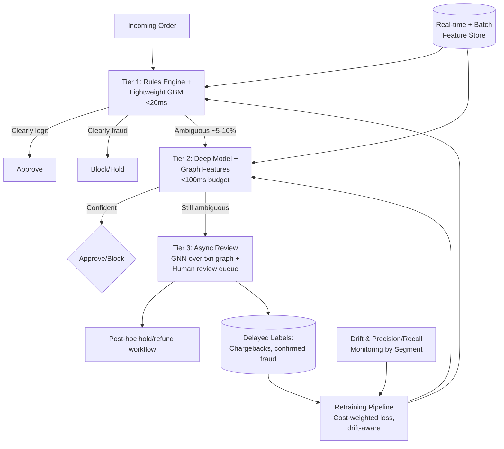
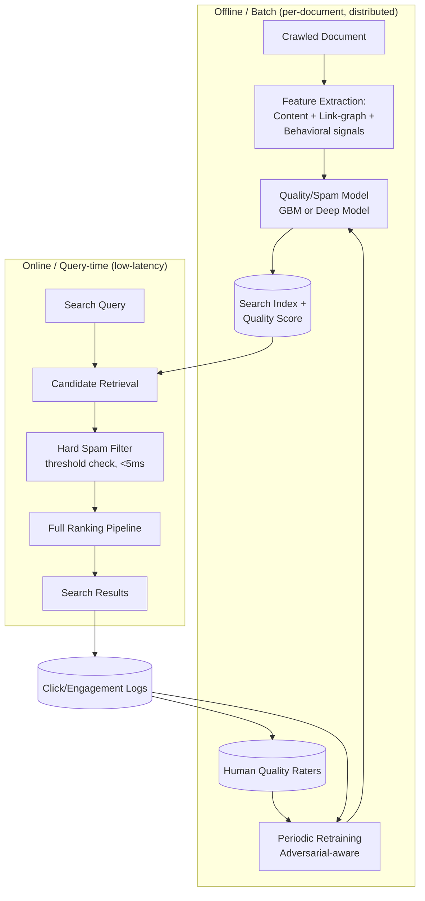
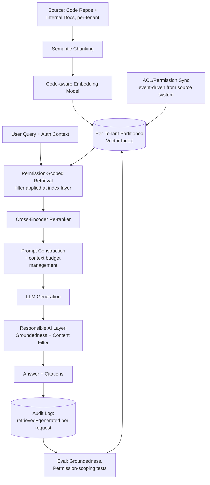

# Staff/Principal ML Engineer Interview Guide — MANGOS (10+ YOE)

> **Scope note:** "MANGOS" isn't a standard industry acronym (unlike FAANG/MAANG), so this guide covers **M**eta, **A**mazon, **N**etflix, **G**oogle, Micr**o**soft, and **S**alesforce — the closest reasonable mapping. At 10+ years of experience you'd typically be interviewing for **Staff / Senior Staff / Principal ML Engineer** (or the equivalent: Meta E6/E7, Amazon L6/L7, Google L6/L7, Microsoft 65/66/67, Netflix Senior/Staff, Salesforce Lead/Principal MTS).
>
> **Honesty note on sources:** None of these companies publish their actual interview question banks, and the specific questions a candidate gets are randomized per loop and covered by NDA. Every question below is a **representative, composite example** — reconstructed from patterns that recur across public sources (Glassdoor, Blind, LeetCode discuss, company engineering blogs, published leveling rubrics) — not a verbatim leaked question. Treat this as a realistic practice set, not a leaked question bank. Compensation figures are pulled live from Levels.fyi and dated accordingly; they are crowdsourced, not official employer figures, and change often — verify before negotiating.
>
> Last compiled: September 3, 2026.

---

## Table of Contents
1. [How the loop generally works at this level](#how-the-loop-generally-works)
2. [Meta](#1-meta)
3. [Amazon](#2-amazon)
4. [Netflix](#3-netflix)
5. [Google](#4-google)
6. [Microsoft](#5-microsoft)
7. [Salesforce](#6-salesforce)
8. [Cross-company compensation summary](#cross-company-compensation-summary)
9. [12-week preparation plan](#12-week-preparation-plan)
10. [Master reference list](#master-reference-list)

---

## How the loop generally works

At 10+ YOE you are almost never evaluated as a pure IC coder. Every company's loop for Staff+ ML roles blends four things in different proportions:

| Round type | What it actually tests | Typical weight at Staff+ |
|---|---|---|
| Coding / DS&A | Can you still write correct, efficient code under pressure | Low-medium (1 round, easier than L4/L5 loops, sometimes replaced by "ML coding" — implement an algorithm like k-means or backprop from scratch) |
| ML breadth & depth | Do you actually understand the math/stats/modeling tradeoffs, or just call `.fit()` | Medium-high |
| ML system design | Can you design a production ML system end-to-end (data → training → serving → monitoring) at scale | **Highest weight** — this is the bar-raising round at Staff+ |
| Behavioral / leadership | Have you actually driven cross-team technical decisions, mentored, handled conflict, shipped ambiguous 0-to-1 work | High — often 2 separate rounds at this level |

Below, each company section gives: JD, round-by-round breakdown with example Q&A, a full worked system-design example with diagram, compensation, references, and prep strategy.

---

## 1. Meta

### Company name & role
**Meta Platforms, Inc.** — Machine Learning Engineer, E6 (Staff) / E7 (Senior Staff). Teams that hire at this level for 10+ YOE candidates: Feed/Ranking (Facebook/Instagram), Reels Ranking, Ads Ranking (Core Ads/Value Model), GenAI (Llama, Meta AI assistant), Integrity/Trust & Safety ML, Reality Labs ML.

### Sample JD (composite, representative of real Meta postings)
> We're looking for an experienced Machine Learning Engineer to join our Ranking/Recommendations team. You'll own the end-to-end lifecycle of large-scale ranking or GenAI systems — from problem formulation and feature engineering through distributed training and low-latency serving. You will set technical direction across a group of ~10–20 engineers, partner with Applied Research Scientists on modeling, and be a DRI (directly responsible individual) for a major ranking surface.
>
> **Minimum qualifications:** 10+ years building and deploying ML systems in production; deep knowledge of deep learning (embeddings, sequence models, transformers), distributed training (PyTorch/DDP or Meta's internal infra), and large-scale recommendation or ranking systems; track record of technical leadership without formal management authority; BS/MS/PhD in CS, ML, or related field (or equivalent experience).
>
> **Preferred:** experience with multi-task/multi-objective ranking, embedding-based retrieval, GPU cluster training at scale, causal inference for product experimentation.

### Interview rounds

**1. Recruiter screen (30 min)** — background, motivation, comp expectations, level calibration.

**2. Coding round (45 min, 1–2 rounds)** — Meta still runs a LeetCode-style round even at E6, but problems skew medium (rarely hard), and interviewers weight *clean, production-quality code and edge-case handling* more than cleverness.

- *Example problem:* "Given a stream of (user_id, item_id, timestamp, score) impressions, design a class that supports `record(event)` and `top_k_recent(user_id, k, window_seconds)` — return the top-k highest-scoring items a user saw in the last `window_seconds`."
- *Best-possible-answer approach:* Use a per-user deque/sliding window + a max-heap (or sorted structure) keyed by score, lazily evicting events older than `window_seconds` on each read. Discuss the tradeoff of eager eviction (background thread) vs. lazy eviction (evict-on-read) for a data-heavy service, and how this generalizes to a real "recently shown candidates" cache in a ranking pipeline.

```python
import heapq
from collections import defaultdict, deque

class RecentTopK:
    def __init__(self):
        self.user_events = defaultdict(deque)  # (timestamp, item_id, score)

    def record(self, user_id, item_id, timestamp, score):
        self.user_events[user_id].append((timestamp, item_id, score))

    def top_k_recent(self, user_id, k, window_seconds, now):
        dq = self.user_events[user_id]
        while dq and dq[0][0] < now - window_seconds:
            dq.popleft()
        return heapq.nlargest(k, dq, key=lambda e: e[2])
```

- *Follow-up (system-thinking, expected at E6):* "How would this look with billions of users and per-user state that doesn't fit in one process's memory?" — Expected answer touches sharding by `user_id` hash, a key-value store (RocksDB/Memcache-backed) instead of in-process dict, TTL-based eviction, and read-through caching.

**3. ML coding round (45 min)** — implement a core algorithm from scratch (no library).

- *Example:* "Implement logistic regression with L2 regularization trained via mini-batch gradient descent, from raw NumPy."
- *Best answer* covers: correct gradient derivation, numerically stable sigmoid (`np.where` or log-sum-exp trick to avoid overflow), vectorized batch updates, and a brief note on why you'd add class-weighting for the imbalanced-label case common in ranking/CTR.

**4. ML system design (60 min) — this is the highest-weighted round.**

> **Problem statement:** "Design the ranking system for Instagram Reels' Explore/For-You feed. Given ~2B monthly active users and a candidate pool of hundreds of millions of videos, design an ML system that serves personalized video recommendations with p99 latency under 200ms."

**Thinking approach (what a strong E6 candidate walks through, in order):**

1. **Clarify objective(s):** Is this optimizing single-metric watch-time, or multi-objective (watch-time + likes/shares/comments + diversity + integrity constraints)? Assume multi-objective, which is realistic.
2. **Funnel architecture, not one giant model:** candidate generation (retrieval) → light-weight ranking (first-pass) → heavy ranking (final) → re-ranking/business logic. This is non-negotiable at scale — you cannot run a full deep model over hundreds of millions of candidates per request.
3. **Candidate generation (retrieval):** two-tower embedding model (user tower + item tower), ANN search (e.g., HNSW/FAISS-style index) to get top ~1,000–10,000 candidates per user from an index refreshed on some cadence (near-real-time for new content freshness).
4. **First-pass (light) ranking:** cheap model (e.g., logistic regression or small MLP on precomputed features) narrows 1,000s → ~100s.
5. **Second-pass (heavy) ranking:** deep multi-task model (e.g., a shared-bottom or Mixture-of-Experts architecture predicting P(watch_full), P(like), P(share), P(report)) scores the ~100–500 candidates.
6. **Combine into final utility score:** weighted sum / learned combiner of the multi-task outputs, with calibration per task; apply integrity/policy filters and diversity re-ranking (e.g., MMR-style penalty for near-duplicate creators/topics) as a final pass.
7. **Feature pipeline:** streaming features (recent engagement, session context) via a feature store with online/offline parity (critical: training-serving skew is the #1 real-world failure mode — call this out explicitly).
8. **Training:** offline batch training on logged impressions with importance-weighting to correct for **position bias** and **exposure/selection bias** (only shown items get labels) — mention inverse propensity scoring or a two-stage debiasing approach.
9. **Serving infra & scaling numbers (be ready to do napkin math):**
   - 2B MAU, assume ~500M DAU, ~20 Reels sessions/day/user, ~10 ranking requests/session → **~100B ranking requests/day ≈ ~1.2M QPS average**, with peak traffic 3–5x average → design for ~4–6M QPS peak.
   - At p99 < 200ms with a funnel of retrieval (ANN, ~10-20ms) + light rank (~20ms) + heavy rank on GPU batch inference (~50-80ms) + re-rank/business logic (~10-20ms), you have a realistic latency budget — call out that heavy-rank GPU inference is the tightest budget line and justify batching + model distillation/quantization to hit it.
   - Storage: two-tower embeddings for 100M+ items at, say, 128-dim fp16 ≈ 25.6GB just for item embeddings — must live in a distributed ANN index (sharded), not a single machine.
10. **Monitoring/feedback loop:** online A/B testing framework, guardrail metrics (session length, reports/hides, creator diversity), and delayed-label handling (watch-time can take hours to fully materialize).
11. **Failure modes to proactively mention:** feedback loops reinforcing popularity bias, cold-start for new creators/videos, staleness of embeddings, training-serving skew, fairness across creator segments.

**System design diagram:**

```mermaid
flowchart LR
    U[User Request] --> RET[Candidate Generation<br/>Two-Tower Embedding + ANN Index<br/>~100M items to top 1-10K]
    RET --> L1[Light Ranker<br/>Linear/Small MLP<br/>1-10K to ~200]
    L1 --> L2[Heavy Ranker<br/>Multi-Task DNN<br/>P(watch), P(like), P(share)]
    L2 --> COMB[Score Combiner +<br/>Calibration]
    COMB --> RR[Re-ranking:<br/>Diversity + Integrity Filters]
    RR --> RESP[Ranked Feed Response]

    FS[(Feature Store<br/>Online + Offline)] --> L1
    FS --> L2
    LOGS[(Impression/Engagement Logs)] --> TRAIN[Offline Training Pipeline<br/>Debiasing + Multi-Task Loss]
    TRAIN --> L1
    TRAIN --> L2
    TRAIN --> RET
    RESP --> LOGS
    MON[Online A/B + Guardrail Monitoring] --> TRAIN
```

**5. ML breadth/depth round (45 min)** — rapid-fire conceptual questions probing whether experience is real.

- *Q: "Walk me through how you'd debug a model whose offline AUC improved but online engagement dropped."* — **Best answer:** frame this as training-serving skew or a proxy-metric mismatch first (check feature parity between training pipeline and serving pipeline), then check for delayed-label leakage in offline eval, then consider that AUC is not the deployed decision metric (rank quality ≠ business metric) and that online effects like position bias or novelty effects aren't captured offline. Propose a shadow-traffic or interleaving experiment to isolate the cause before a full rollback.
- *Q: "When would you choose a two-tower retrieval model over a graph-based (e.g., PinSAGE-style) approach?"* — discuss latency/index-update-cost tradeoffs, cold start behavior, and that two-tower is usually the pragmatic choice when you need sub-20ms ANN retrieval at massive scale, while graph approaches shine when relational structure (who-follows-whom, co-engagement graphs) is the dominant signal.

**6. Behavioral rounds (2 rounds, ~45 min each)** — Meta doesn't use as rigid a rubric as Amazon's Leadership Principles, but interviewers score against internal competencies: *Direction*, *Execution*, *Communication*, *Innovation*, *Talent* (roughly).

| Sample question | Best-possible-answer structure |
|---|---|
| "Tell me about a time you disagreed with a technical decision and how you resolved it." | STAR: pick a case where you had *data*, not just opinion. Show you escalated respectfully, ran an experiment to settle the disagreement empirically, and describe the outcome — including if you were wrong. Meta values people who resolve disagreement with evidence, not authority. |
| "Describe the most technically complex system you've owned end-to-end." | Emphasize *scope* (what % of a business metric it moved, how many engineers depended on it), the hardest tradeoff you made, and how you handled an incident or regression in it. |
| "Tell me about a time you had to influence a team you didn't manage." | Show cross-functional leverage — a PRD/design doc you wrote that others adopted, or a technical RFC that changed another team's roadmap. |

### Compensation (Meta, US, ML Engineer — via Levels.fyi, updated 8/31/2026)
- **Range:** $187K (E3) to **$1.45M** (E7)
- **Median (all levels):** ~$476–479K
- E6 (Staff, most common landing level at 10+ YOE) commonly lands in the **$550K–$750K** total-comp band once you weight base + RSU + bonus, though exact E6 medians fluctuate by team/location; verify current E6-specific figures on Levels.fyi before negotiating, as the site aggregates by title, not always cleanly by level.
- Structure: base salary (capped, doesn't scale linearly with level) + significant RSU grant (4-year vest, front-loaded in later refreshers) + cash bonus (~10-15%, performance-linked).

### References
- Meta engineering blog — Instagram/Facebook ranking architecture writeups: https://engineering.fb.com/category/ml-applications/
- Meta Careers — official ML Engineer postings and leveling guide: https://www.metacareers.com/jobs
- Levels.fyi Meta ML Engineer data: https://www.levels.fyi/companies/meta/salaries/software-engineer/title/machine-learning-engineer
- Blind (candid, unverified interview experiences): https://www.teamblind.com/company/Meta/topics
- "Designing Deep Learning Systems" and academic references on two-tower retrieval (Google's "Deep Neural Networks for YouTube Recommendations" paper is the canonical citation interviewers expect you to know)

### Prep strategy (Meta-specific)
- Prioritize the **system design round** — it's the highest-weighted and most Meta-specific (ranking/recommendation heavy). Study the YouTube DNN recommendations paper, two-tower retrieval, and Meta's public DLRM (Deep Learning Recommendation Model) paper.
- For coding, LeetCode mediums (arrays, hash maps, heaps, sliding window) 3x/week; don't over-invest in hards.
- Prepare 5-6 STAR stories mapped to *scope, ambiguity, conflict, technical depth, mentorship* — Meta behavioral interviewers reuse the same story across multiple questions if you signal it fits.

---

## 2. Amazon

### Company name & role
**Amazon.com, Inc.** — Applied Scientist or Senior/Principal Machine Learning Engineer, L6 (Senior)/L7 (Principal). Common orgs: AWS AI/ML (SageMaker, Bedrock), Alexa AI, Amazon Ads, Supply Chain Optimization Technologies (SCOT), Fulfillment/Robotics ML.

### Sample JD (composite)
> As a Senior/Principal Machine Learning Engineer, you will design, build, and scale ML systems that directly impact millions of customers. You'll be the technical owner for a critical ML pipeline — from data collection through model training, deployment, and monitoring — and will mentor engineers while partnering with Principal Engineers and Scientists on long-term technical strategy.
>
> **Basic qualifications:** 10+ years of non-internship industry experience; experience building production ML systems at scale; proficiency in Python and one deep learning framework (PyTorch/TensorFlow); experience with distributed systems and cloud infrastructure (AWS preferred).
>
> **Preferred:** experience publishing internally/externally, driving org-wide technical initiatives, mentoring senior engineers, and working with petabyte-scale data.

### Interview rounds

**1. Recruiter screen + Leadership Principles pre-check (30 min).**

**2. Online Assessment / Coding phone screen (60 min).**

- *Example problem:* "Given a large log of (product_id, click, purchase) events, design and implement an efficient algorithm to compute the top-N products by conversion rate, excluding products with fewer than `min_impressions`."
- *Best answer:* single-pass streaming aggregation (dict of counts), then a min-heap of size N for the top-N pass (`O(M log N)` instead of sorting all `M` products), explicitly handle the Bayesian-smoothing angle (raw conversion rate is noisy for low-impression items even above the threshold — mention Wilson score interval or Laplace smoothing as the "senior" insight interviewers are listening for).

**3. Onsite Loop (4-6 rounds, all Amazon rounds are explicitly graded against Leadership Principles in addition to technical content):**

- **Coding round** (similar style to above, plus a data-structure design question, e.g., "design a rate limiter for a training-data ingestion service").
- **ML Depth round:** deep-dive on your own past project — expect the bar raiser to push hard on *why* you made specific modeling choices ("why XGBoost over a neural net here," "how did you pick your loss function," "what would you do differently").
- **ML System Design round.**
- **2x Behavioral (Leadership Principles) rounds**, one of which is the **Bar Raiser** — an interviewer from outside the hiring team with veto power, focused on culture fit and raising the long-term talent bar.

**4. ML System Design — full worked example**

> **Problem statement:** "Design a fraud-detection system for Amazon's marketplace that scores every order in real time (sub-100ms) for fraud risk, at a scale of tens of millions of orders/day, with a hard requirement that the false-positive rate on legitimate high-value customers stays extremely low."

**Thinking approach:**

1. **Clarify the cost asymmetry:** false negatives (missed fraud) cost money directly; false positives (blocking legitimate customers) cost trust/lifetime value — this is a classic imbalanced, asymmetric-cost problem, not a simple accuracy-maximization problem. State this up front — it drives every downstream choice (threshold selection, loss weighting, metric choice: precision-recall / cost-weighted F-beta over raw accuracy).
2. **Two-tier system, like Reels but for fraud:**
   - **Tier 1 — real-time rules + lightweight model** (sub-20ms): catches obvious fraud patterns (velocity checks — too many orders from one card in an hour, geo-mismatch, known-bad device fingerprints) using a gradient-boosted tree (fast inference, interpretable, easy to audit — important for a domain with legal/compliance scrutiny).
   - **Tier 2 — deep model for ambiguous cases** (sub-100ms budget, only invoked for the ~5-10% of orders Tier 1 flags as "uncertain"): a model combining transaction features, user history embeddings, and graph features (shared devices/addresses/payment instruments across accounts — fraud rings show up as graph clusters).
   - **Tier 3 — async/offline:** cases too ambiguous even for Tier 2 get queued for manual review or a slower, heavier model (e.g., a GNN over the full transaction graph) that updates risk scores after the order already went through, feeding a hold/refund workflow.
3. **Feature store:** must serve both real-time (streaming click/session features) and batch (account history, aggregate stats) features with consistent point-in-time correctness to avoid label leakage (a huge, realistic failure mode in fraud modeling — using a feature that wouldn't have been known yet at prediction time).
4. **Class imbalance handling:** fraud is typically <1% of orders. Use `scale_pos_weight` in GBM/XGBoost, focal loss for the deep model, and evaluate with **precision-recall AUC and cost-weighted metrics**, not accuracy or vanilla ROC-AUC.
5. **Label latency problem:** true fraud labels ("chargeback confirmed") can take **weeks** to materialize — design the training pipeline to handle delayed, and possibly *corrected*, labels (a "confirmed legitimate" today can be re-labeled "fraud" months later after a chargeback).
6. **Scaling numbers:** tens of millions of orders/day → ~300-1,200 orders/sec average, with holiday peak (Prime Day/Black Friday) potentially 10-20x → design Tier-1 to comfortably handle **10K+ QPS** bursts via horizontal autoscaling and Tier 2/3 to shed load gracefully (queue-based backpressure) rather than fail.
7. **Monitoring:** track model drift on feature distributions (fraud patterns evolve adversarially — this is not a stationary problem, fraudsters actively adapt), alert on precision/recall degradation per segment, and maintain a human-in-the-loop review queue whose labels feed back into retraining.

**Diagram:**



**5. Leadership Principles — likely questions & best-answer structure (STAR + explicit LP tag):**

| LP | Sample question | Best-answer approach |
|---|---|---|
| Ownership | "Tell me about a time you fixed a problem that wasn't technically your job." | Pick a case with lasting, measurable impact; explicitly narrate the "long-term thinking beyond my ticket" angle. |
| Are Right, A Lot | "Tell me about a decision you made with incomplete data." | Show a structured framework (hypothesis → cheapest experiment → decision), not just gut instinct. |
| Deliver Results | "Tell me about a time you had to make a tradeoff between speed and quality." | Quantify the business metric moved and be honest about what you sacrificed and how you mitigated the risk. |
| Earn Trust | "Tell me about a time you gave difficult feedback to a peer or more senior engineer." | Show specificity, kindness, and a concrete outcome — Amazon bar raisers probe hard on vague answers here. |
| Invent and Simplify | "Tell me about the most complex problem you simplified." | Contrast the complex-but-tempting approach you *didn't* take against the simpler one you shipped, and why. |

At L6/L7, expect the bar raiser to specifically probe **"Have Backbone; Disagree and Commit"** — be ready with a story where you pushed back on a senior stakeholder (even a VP) with data, and then fully committed once the decision was made even though you disagreed.

### Compensation (Amazon, US, ML Engineer — via Levels.fyi, updated 8/25/2026)
- **Range:** $177K (L4) to **$483K** (L6)
- **Median (all levels):** $280K
- L6 (Senior, the common 10+ YOE landing level) tops out near the $483K figure reported; L7 (Principal) typically clears $500K-$650K+ total comp in practice, though Amazon's public L7 ML sample size on Levels.fyi is thinner — verify current numbers.
- Amazon's comp is famously **base-capped, RSU-back-loaded** (the classic "Amazon signing bonus + Y1/Y2 cash offset, RSU vesting 5/15/40/40 over 4 years" structure) — read the offer letter vesting schedule carefully, not just the headline TC number.

### References
- Amazon Jobs — official ML/Applied Scientist postings: https://www.amazon.jobs/en/job_categories/machine-learning-science
- Amazon Leadership Principles (official): https://www.amazon.jobs/en/principles
- AWS Machine Learning Blog (real production system writeups): https://aws.amazon.com/blogs/machine-learning/
- Levels.fyi Amazon ML Engineer data: https://www.levels.fyi/companies/amazon/salaries/software-engineer/title/machine-learning-engineer
- "Are You a Bar Raiser?" — general public writeups on the Bar Raiser process (search Amazon's own careers blog)

### Prep strategy (Amazon-specific)
- Amazon weighs behavioral more heavily, relative to other MANGOS companies, than any other in this list — **prepare 12-15 STAR stories**, each pre-tagged to 2-3 Leadership Principles, because the same story often gets reused across the loop from different angles.
- For system design, practice the **imbalanced-class + asymmetric-cost framing** — it recurs across fraud, ads-fraud, returns-abuse, and supply-chain-anomaly problems, all common Amazon system design prompts.
- Know AWS ML infra by name even if you don't use AWS day-to-day (SageMaker, Bedrock, Feature Store) — interviewers will map your design vocabulary onto AWS primitives.

---

## 3. Netflix

### Company name & role
**Netflix, Inc.** — Senior/Staff Machine Learning Engineer. Netflix has a notably **flat org** — there is no traditional "Staff" title ladder the way Google/Meta have; a Senior IC at Netflix is expected to operate with Staff-level autonomy and scope (the "Netflix culture" of extreme ownership and minimal process is itself part of the evaluation). Common orgs: Personalization & Recommendations, Content ML (title artwork optimization, trailer selection), Ads ML (post-2023 ad-tier build-out), Studio/Production ML.

### Sample JD (composite)
> Netflix is looking for a seasoned Machine Learning Engineer to help drive the future of personalization and content understanding. You'll work with a small, highly autonomous team, own your roadmap with minimal oversight, and be trusted to make consequential technical decisions without layers of process ("Freedom & Responsibility"). Deep experience with recommendation systems, causal inference/experimentation, or large-scale content understanding is highly valued.
>
> **Requirements:** 10+ years building production ML systems; strong statistics/causal-inference background (Netflix runs an enormous number of A/B tests — statistical rigor is core to the culture); track record of independent, high-judgment decision-making; comfortable with ambiguity and a low-process environment.

### Interview rounds

Netflix's loop is comparatively **leaner** than Meta/Amazon/Google (fewer total rounds, no gimmicky whiteboard-heavy trivia) but each round is unusually deep and conversational, and the "culture add" bar (Netflix Culture Memo — Freedom & Responsibility, Candor, "adequate performance gets a generous severance") is explicitly and heavily weighted.

**1. Recruiter/Hiring Manager screen (45 min)** — more substantive than most companies' initial screens; expect real technical discussion here, not just logistics.

**2. Technical deep-dive on past work (60 min)** — Netflix interviewers spend an unusually large fraction of the loop having you defend a project you actually shipped, rather than abstract puzzles.

- *Example prompt:* "Walk me through a model you owned end-to-end, including a time it underperformed in production and what you did."
- *Best answer* structure: frame as (1) business problem, (2) why you chose your specific modeling approach over alternatives, (3) a specific failure or regression, (4) root cause, (5) fix, (6) what changed in how you build things afterward. Netflix interviewers will interrupt and probe any hand-wavy claim — be ready to go 3 layers deep on any assertion.

**3. Coding round (45-60 min)** — lighter-weight than Meta/Amazon/Google; often closer to "write working code for a realistic small task" than LeetCode-style puzzles.

- *Example:* "Write a function to compute a exponentially-weighted moving average of a user's engagement score from a stream of events, handling irregular time gaps correctly."
- *Best answer* uses time-aware decay (`weight = exp(-Δt / half_life)`), not a naive fixed-window EWMA, and explicitly discusses why irregular gaps break the naive formula.

**4. ML System Design — full worked example**

> **Problem statement:** "Design the system that selects which artwork/thumbnail image to show for a given title to a given user on the Netflix homepage, to maximize the likelihood they click and then actually watch (not just click and abandon)."

**Thinking approach:**

1. **Clarify the real objective — this is a trap question if you optimize naively.** Optimizing raw click-through rate alone rewards clickbait-y thumbnails that get clicks but high abandonment. State explicitly you'd optimize a **downstream, delayed engagement metric** (e.g., watch-through past some threshold, or a learned "quality-adjusted click" objective), not raw CTR.
2. **This is a contextual bandit / personalized ranking problem**, not a static image-quality-scoring problem — the *same title* should show *different artwork* to different users based on their taste profile (e.g., a horror fan sees a moodier still from a comedy-horror hybrid; a comedy fan sees a lighter still from the same title).
3. **Architecture:**
   - Offline: generate/curate a candidate pool of artwork images per title (a handful to a few dozen, not infinite — this is bounded by content ops, unlike ranking a huge item catalog).
   - A model scores `P(watch | user, title, artwork_variant)` using user taste-embedding + artwork visual/semantic embedding (extracted via a CNN/vision-transformer) + title metadata.
   - Because the candidate set per title is small, this is computationally cheap to score exhaustively per request — no need for an ANN retrieval funnel like the Reels example. This is an important contrast to draw explicitly (shows judgment about when the "funnel" pattern applies and when it doesn't).
4. **Exploration/exploitation:** must continuously explore under-shown artwork variants (contextual bandit, e.g., Thompson sampling or an epsilon-greedy layer on top of the base model) to keep learning which artwork works for which user segments, especially for new titles with no engagement history yet (cold start).
5. **Experimentation rigor (Netflix's signature strength — bring this up proactively):** every artwork policy change is validated with a randomized controlled experiment; describe using a proper **stratified/paired experiment design** (Netflix is well known publicly for its causal-inference-heavy A/B testing culture) and guardrail metrics (don't let artwork optimization increase clicks while decreasing overall session satisfaction/retention).
6. **Scale:** hundreds of millions of members, but the tighter constraint is not raw QPS (this can be precomputed/cached per user-title pair and refreshed periodically) — the interesting scaling problem is the **combinatorial explosion** of (user segment × title × artwork variant) combinations needing enough traffic to reach statistical significance. Discuss hierarchical/segment-level modeling (cluster users into taste segments) rather than fully per-user personalization when data is sparse.
7. **Monitoring:** track long-term retention impact, not just short-term click/watch metrics — Netflix explicitly optimizes for member satisfaction and retention over vanity engagement metrics; call this out as a differentiator from a generic ranking answer.

**Diagram:**

```mermaid
flowchart LR
    REQ[Homepage Render Request<br/>user, title] --> CAND[Candidate Artwork Pool<br/>per title, ~5-30 variants]
    CAND --> SCORE[Scoring Model:<br/>P(watch-through | user, title, artwork)]
    UE[(User Taste Embeddings)] --> SCORE
    AE[(Artwork Visual/Semantic<br/>Embeddings)] --> SCORE
    SCORE --> BANDIT[Exploration Layer:<br/>Contextual Bandit /<br/>Thompson Sampling]
    BANDIT --> SELECT[Selected Artwork]
    SELECT --> CACHE[(Precomputed per<br/>user-title cache)]
    CACHE --> REQ

    LOGS[(Impression + Watch-through Logs)] --> EXP[Experimentation Platform:<br/>Stratified A/B + Guardrails]
    EXP --> RETRAIN[Retrain Scoring Model]
    RETRAIN --> SCORE
    EXP --> GUARD[Guardrail: Long-term<br/>Retention Monitoring]
```

**5. "Culture" / Judgment interviews (2 rounds, ~45-60 min each)** — explicitly framed around the Netflix Culture Memo. This is functionally Netflix's behavioral round but with sharper edges than most companies' "behavioral" rounds.

| Sample question | Best-answer approach |
|---|---|
| "Tell me about a time you gave someone (including someone senior to you) blunt, direct feedback." | Netflix explicitly rewards *candor over comfort* — pick a real example where you said the hard thing directly, not diplomatically hedged, and show the relationship survived/improved. Avoid "sandwich feedback" framing; Netflix culture explicitly discourages it. |
| "Describe a time you made a significant decision without asking permission." | This is testing *Freedom & Responsibility* directly — show you correctly judged when a decision was yours to make, acted, and took ownership of the outcome (good or bad). |
| "Tell me about the best team you've been on and why." | They're listening for whether your definition of "best team" matches Netflix's stated values (high talent density, low process, candor) rather than "supportive/comfortable." |
| "What's a strongly-held opinion you've changed your mind on?" | Demonstrates intellectual honesty — pick something substantive, not superficial, and be specific about what evidence changed your view. |

### Compensation (Netflix, US, ML Engineer — via Levels.fyi)
- **Range reported:** roughly $520K–$650K, **median ~$585K**, with L5 (Senior) reported around $571K.
- Netflix's structure is unusual and worth calling out explicitly in the doc since it changes how you should think about an offer: Netflix pays almost entirely in **cash**, with an optional employee choice to take part of comp as stock options instead of cash (no traditional RSU-heavy structure like Meta/Google/Amazon). This means Netflix TC numbers are *much closer to guaranteed* than an RSU-heavy package elsewhere, but you give up (or must actively opt into) upside from stock appreciation.
- No traditional bonus structure either — comp is designed to be "pay top of personal market" in cash, reviewed and adjusted proactively (in theory) rather than through a bonus/refresh cycle.

### References
- Netflix Culture Memo (official, the single most important document to read before interviewing there): https://jobs.netflix.com/culture
- Netflix Technology Blog (real production ML writeups, e.g., personalization/artwork case studies): https://netflixtechblog.com/
- Levels.fyi Netflix ML Engineer data: https://www.levels.fyi/companies/netflix/salaries/software-engineer/title/machine-learning-engineer
- Netflix's public papers/talks on the artwork personalization system and off-policy evaluation for recommendations (search "Netflix artwork personalization" and "Netflix off-policy bandit" on their tech blog)

### Prep strategy (Netflix-specific)
- Read the **Culture Memo twice** and prepare stories that genuinely reflect Freedom & Responsibility and Candor — generic behavioral prep from other companies can actively backfire here if it sounds "corporate" or conflict-averse.
- Go deep on **causal inference and experimentation design** — Netflix's ML interviews lean harder into statistics/experimentation rigor than pure deep-learning trivia compared to Meta/Google.
- Prepare your "defend a past project in depth" narrative meticulously; this round carries outsized weight relative to other companies.

---

## 4. Google

### Company name & role
**Google (Alphabet Inc.)** — Staff Software Engineer, ML specialization / Staff Machine Learning Engineer, L6 (Staff)/L7 (Senior Staff). Common orgs: Search/Ads ranking, YouTube recommendations, Google Cloud AI (Vertex AI), DeepMind-adjacent applied teams, Assistant/Gemini applied teams.

### Sample JD (composite)
> As a Staff Software Engineer specializing in Machine Learning, you will lead the design and implementation of large-scale ML systems, working across the full stack from research prototyping to production-scale serving on Google's infrastructure (Borg/TPU fleets). You'll set technical direction for a team, review designs across the org, and represent your team in cross-functional technical decisions.
>
> **Minimum qualifications:** 8+ years of software development experience (10+ typical for external Staff hires); experience with one or more general-purpose programming languages; experience in ML, information retrieval, distributed systems, or applied research; experience leading design reviews and setting technical direction.
>
> **Preferred:** PhD or equivalent research experience; experience with TensorFlow/JAX; publications or patents; experience with TPU-scale distributed training.

### Interview rounds

Google's loop is the most standardized/structured of the six (each interviewer submits an independent written feedback packet that goes to a separate **hiring committee**, not the hiring manager — this is a key structural difference worth knowing).

**1. Recruiter screen + resume/phone screen (45-60 min, 1-2 rounds)** — typically one coding-heavy phone screen even before onsite.

**2. Onsite loop (4-5 rounds):**
- **1-2 Coding/algorithms rounds** — Google is historically the most classically "LeetCode-style" of the six, though at Staff level questions skew toward correctness/complexity discussion over speed.
- *Example:* "Given a large corpus of documents and their embeddings, design an algorithm to find, for each document, its k nearest neighbors, that scales sub-linearly better than brute force." — expects discussion of LSH (locality-sensitive hashing) or a tree/graph-based ANN structure (e.g., HNSW), tradeoffs of exact vs. approximate NN, and Big-O analysis of both approaches.
- **1 "Googleyness & Leadership" round** — Google's behavioral round, explicitly named and calibrated in their rubric.
- **1-2 ML System Design / "Domain expertise" rounds.**

**3. ML System Design — full worked example**

> **Problem statement:** "Design an ML system to detect and filter spam/low-quality search results before they reach ranking, at Google Search's scale (tens of billions of queries/month, effectively web-scale documents)."

**Thinking approach:**

1. **Separate the two sub-problems explicitly:** (a) *document-level* spam/quality classification (offline, applied once per crawled page, independent of any specific query) and (b) *query-time* filtering/adjustment (online, must be fast, applied per search request). Conflating these is a common candidate mistake — call out the distinction immediately.
2. **Document-level pipeline (offline, batch):**
   - Feature extraction at crawl/index time: content features (text quality signals, duplicate/near-duplicate detection via minhash/simhash), link-graph features (PageRank-style authority signals, spammy link farm detection via graph anomaly patterns), behavioral features (historical CTR/bounce patterns for that domain if available), and metadata (domain age, hosting patterns).
   - A gradient-boosted or deep model outputs a **quality/spam score per document**, stored in the index alongside the document — this must scale to **tens of billions of documents**, so emphasize that this pipeline runs as a distributed batch job (MapReduce/Flume-style), re-scored periodically (not on every crawl) with incremental updates for freshly crawled content.
3. **Query-time layer (online, low-latency):**
   - At serving time, the quality score is one input among many into the final ranking function, but there also needs to be a **hard filter/threshold** for the worst spam (adversarial content specifically targeting query intent — e.g., keyword-stuffed pages) that shouldn't even reach ranking, applied during the initial retrieval/candidate-generation stage to save compute downstream.
4. **Adversarial dynamics — call this out explicitly, it's the crux of the problem and distinguishes a senior answer:** spam is not a stationary distribution; spammers actively adapt to your classifier (an adversarial, not just imbalanced, classification problem). Discuss: (a) the need for a fast feedback loop (rapid re-training cadence, human-rater-labeled samples via Google's Search Quality Raters), (b) ensembling/diverse-signal robustness so no single feature is easy to game, (c) monitoring for sudden shifts in specific spam techniques (concept drift specific to adversarial behavior, not gradual data drift).
5. **Scale/latency numbers:** Search serves on the order of tens of billions of queries per month → roughly on the order of **100K+ QPS globally, sustained**, with the entire ranking pipeline needing to return results in a low-hundreds-of-milliseconds budget — spam filtering must be a low-single-digit-millisecond addition to that budget, reinforcing why it has to be mostly precomputed offline with only a thin online lookup+threshold layer.
6. **Evaluation:** precision is paramount over recall for the hard-block layer (falsely blocking legitimate content is a severe trust failure for a search engine) — discuss a human-rater-in-the-loop evaluation process (this is a real, well-known part of how Google evaluates search quality) alongside offline classifier metrics.

**Diagram:**



**4. Googleyness & Leadership round** — sample questions and best-answer structure:

| Sample question | Best-answer approach |
|---|---|
| "Tell me about a time you had to work with ambiguous or incomplete requirements." | Show your process for reducing ambiguity (scoping a spike/prototype, writing a design doc to force stakeholder alignment) rather than either freezing or barreling ahead unilaterally — Google explicitly values structured handling of ambiguity. |
| "Describe a time you helped a struggling colleague." | Google's rubric explicitly checks for "helps others succeed" as a leadership signal distinct from formal management — pick a mentorship story with a concrete, measurable outcome for the other person. |
| "Tell me about a time you received critical feedback." | Show genuine behavior change, not just "I listened and said thank you" — be specific about what changed. |

### Compensation (Google, US, ML Engineer — via Levels.fyi)
- **Range:** $199K (L3) to **$743K** (L7)
- **Median (all levels):** ~$288K
- **L6 (Staff)** — using Google's general SWE L6 band as the closest calibration point (ML-specific L6 sample sizes are thinner): reported median around **$587K**, typical range roughly $530K–$728K, per crowdsourced data.
- Comp structure: base salary + **GSU (Google Stock Units — Google's name for RSUs)**, vesting quarterly/monthly depending on grant size, + annual cash bonus (target ~15% at Staff level) + a "GRC" annual equity refresh reviewed yearly based on performance rating.

### References
- Google Careers — official ML/Staff SWE postings: https://www.google.com/about/careers/applications/jobs/results/?employment_type=FULL_TIME&q=machine%20learning%20engineer
- Google AI Blog / Google Research publications: https://research.google/blog/
- "Deep Neural Networks for YouTube Recommendations" (Covington et al.) — canonical paper interviewers expect familiarity with for ranking system design
- Levels.fyi Google ML Engineer data: https://www.levels.fyi/companies/google/salaries/software-engineer/title/machine-learning-engineer
- Levels.fyi Google L6 band data: https://www.levels.fyi/companies/google/salaries/software-engineer/levels/l6

### Prep strategy (Google-specific)
- Google's coding bar is the most classically algorithmic of the six — don't neglect LeetCode practice the way you might for Netflix.
- Google hiring committees read **written interviewer feedback**, not live impressions — this means being explicit and structured out loud (narrate your reasoning, name your tradeoffs) matters more here than at companies where the interviewer forms a holistic gut impression.
- Study information retrieval fundamentals (inverted indices, PageRank, LSH/ANN) even for a "pure ML" role — Google's ML system design questions frequently intersect with classic IR.

---

## 5. Microsoft

### Company name & role
**Microsoft Corporation** — Principal Applied Scientist / Principal Machine Learning Engineer, level 65/66/67 (roughly Staff/Senior Staff/Principal). Common orgs: Microsoft AI (Copilot across M365/GitHub/Azure/Windows), Azure AI Platform, Bing, LinkedIn ML (owned by Microsoft, often recruits separately), Turing team (foundation models).

### Sample JD (composite)
> We are looking for a Principal Machine Learning Engineer to help build and scale AI features across Microsoft Copilot products. You will own the ML architecture for a major product surface, drive technical strategy across partner teams, and mentor senior engineers. Experience with large language models, retrieval-augmented generation, and responsible AI practices is highly valued.
>
> **Required qualifications:** 10+ years of experience in ML engineering, software engineering, or applied research; experience with cloud-scale distributed systems (Azure preferred); demonstrated ability to lead technical projects across multiple teams.
>
> **Preferred:** experience with LLM fine-tuning/RLHF/RAG systems; experience with responsible AI/fairness tooling; prior technical leadership without formal management title.

### Interview rounds

**1. Recruiter screen (30 min).**

**2. Technical phone screen (60 min)** — coding + light system design.

**3. Onsite/virtual "as-a-loop" (4-5 rounds, ~45-60 min each):**
- **1-2 Coding rounds.**
- **1-2 System design rounds** (increasingly GenAI/Copilot-flavored given Microsoft's current product focus).
- **1 "As Appropriate" (AA) round** — an interviewer, usually more senior, who has read all other feedback before their round and has explicit authority to be the tie-breaker/final gate — structurally similar in spirit to Amazon's Bar Raiser but Microsoft-specific in name and process.
- Behavioral content is woven into most rounds via Microsoft's internal competency model (Microsoft doesn't have as famous/public a rubric name as Amazon's LPs, but interviewers score against known internal leadership competencies: *Model*, *Coach*, *Care*, plus growth-mindset framing pervasive in Microsoft culture since Satya Nadella's tenure).

**4. ML System Design — full worked example**

> **Problem statement:** "Design a retrieval-augmented generation (RAG) system for GitHub Copilot Chat (or an equivalent enterprise Copilot) that lets it answer questions grounded in a company's private codebase and internal docs, at enterprise scale (thousands of orgs, each with potentially millions of files), while respecting per-user/per-repo access permissions."

**Thinking approach:**

1. **State the two hardest constraints up front, because they're what make this different from a generic RAG demo:** (a) **permissions-aware retrieval** — you cannot let retrieval leak content a given user isn't authorized to see, even indirectly through a generated answer; (b) **multi-tenant isolation at scale** — thousands of independent enterprise codebases, each needing fresh, correctly-scoped indices.
2. **Ingestion & indexing pipeline:**
   - Chunk source code and docs (respecting semantic boundaries — function/class boundaries for code, not naive fixed-length windows) and embed each chunk with a code-aware embedding model.
   - Store embeddings in a **per-tenant (or per-repo) partitioned vector index** — explicitly reject a single shared global index for permission-safety reasons; partitioning is a security requirement here, not just a performance optimization.
   - Attach ACL metadata (which teams/users can access this chunk) to every indexed item, propagated from the source system's actual permission model (e.g., GitHub repo/branch permissions) and kept in sync via webhook/event-driven updates (permissions and content both change continuously — staleness here is a security bug, not just a quality bug).
3. **Retrieval-time flow:**
   - User query → retrieve candidate chunks from the *user's authorized scope only* (permission filter applied at the retrieval/index layer, not as an after-the-fact filter on the LLM's output — filtering after generation is a security anti-pattern, since the model may have already "seen" unauthorized content in its context).
   - Re-rank retrieved chunks for relevance (a cross-encoder re-ranker over the top-k from the vector search) before constructing the LLM prompt/context window.
4. **Generation:**
   - Construct a grounded prompt with retrieved chunks + citations; call the LLM (with appropriate context-window budget management — enterprise codebases mean you must be aggressive about chunk selection since you can't fit "everything relevant").
   - Post-process for citation/grounding — explicitly cite which files/chunks the answer draws from, both for user trust and for audit/compliance requirements common in enterprise contexts.
5. **Responsible AI layer (explicitly expected at Microsoft given their public Responsible AI commitments):** content filtering for harmful outputs, groundedness scoring (does the generated answer actually derive from retrieved content, or is it hallucinating beyond the grounding?), and an audit log of what was retrieved/generated per request for enterprise compliance needs.
6. **Scale numbers:** thousands of enterprise tenants, each with up to millions of files → discuss sharding the vector index by tenant (natural partition boundary that also solves the isolation requirement), incremental re-indexing on file change (event-driven, not full re-index) to keep freshness reasonable (target: minutes-to-low-single-digit-hours staleness, not days), and a caching layer for repeated/similar queries within a tenant to control LLM inference cost, which dominates the cost structure of a RAG system at this scale far more than the retrieval step does.
7. **Evaluation:** groundedness/faithfulness metrics (is the answer actually supported by retrieved context), retrieval precision/recall against a labeled eval set, and enterprise-specific metrics like "% of queries where correct permission-scoping was verified" as an explicit security-testing metric, not just a quality one.

**Diagram:**



**5. Behavioral / "As Appropriate" round — sample questions:**

| Sample question | Best-answer approach |
|---|---|
| "Tell me about a time you had to change your approach based on new information." | Microsoft's culture (post-Nadella) explicitly rewards growth-mindset framing — narrate genuinely updating your belief, not just "sticking the landing" on a plan you never revised. |
| "Describe a time you coached or grew a more junior engineer into a stronger contributor." | Focus on specific, observable growth in the other person, since Microsoft's competency model explicitly separates "Coach" from raw technical output. |
| "Tell me about a cross-org technical initiative you drove." | Given Microsoft's massive org (Windows, Azure, M365, Gaming, etc. all separate business units), cross-org influence without authority is a specifically valued signal — pick a story that shows navigating organizational complexity, not just technical complexity. |

### Compensation (Microsoft, US, ML/Principal — via Levels.fyi & aggregated sources)
- **General 66-level SWE band (closest public calibration for Principal ML at 10+ YOE):** median total comp **~$415,667**, typical range **$311K–$548K+**.
- **ML-specific role, all levels (59/AS to 66+/Partner AS)** per aggregated public-source data: total comp spans roughly **$150K to $1.3M** across the full ladder, with a typical **mid-level** package around $355K — Principal-level (65/66) candidates should expect to land well above that midpoint, broadly consistent with the general 66-band figure above.
- Structure: base + annual cash bonus (target ~0-30% depending on level, tied to a "Connect" performance rating) + a **front-loaded, multi-year RSU grant** (Microsoft historically grants a large upfront award vesting over ~4-5 years rather than smaller annual refreshers, though refresh practices have evolved — confirm current-year specifics with your recruiter).

### References
- Microsoft Careers — official postings: https://careers.microsoft.com/
- Microsoft Research blog: https://www.microsoft.com/en-us/research/blog/
- Microsoft Responsible AI resources (directly relevant to Copilot/GenAI system design rounds): https://www.microsoft.com/en-us/ai/responsible-ai
- Levels.fyi Microsoft 66-band data: https://www.levels.fyi/companies/microsoft/salaries/software-engineer/levels/66
- gitGood.dev Microsoft ML Engineer comp aggregation: https://gitgood.dev/comp/microsoft/mle

### Prep strategy (Microsoft-specific)
- Given Microsoft's current product focus, **RAG/Copilot-flavored system design is now the single most likely scenario type** — practice the permissions-aware, multi-tenant RAG pattern specifically, it recurs across nearly every Copilot surface (GitHub, M365, Azure).
- Explicitly rehearse groundedness/hallucination-mitigation and Responsible AI framing in your answers — Microsoft interviewers are primed to listen for this given the company's public RAI commitments.
- Prepare a genuine "I changed my mind" story — growth-mindset framing is culturally load-bearing at Microsoft in a way it isn't as explicitly at the other five companies.

---

## 6. Salesforce

### Company name & role
**Salesforce, Inc.** — Lead/Principal Member of Technical Staff (MTS), Machine Learning Engineer. Common orgs: Einstein AI/Agentforce, Salesforce Data Cloud ML, Tableau AI (owned by Salesforce), Slack AI.

### Sample JD (composite)
> As a Lead/Principal ML Engineer on the Agentforce/Einstein team, you'll design and scale the ML systems powering autonomous AI agents embedded across Salesforce's CRM products. You'll own technical architecture for a major ML capability, mentor a team of engineers, and work closely with product and enterprise customers on requirements shaped by real B2B/enterprise constraints (trust, data governance, multi-tenancy).
>
> **Required:** 10+ years of software/ML engineering experience; experience building production ML/LLM systems at scale; strong understanding of multi-tenant SaaS architecture; experience with enterprise data governance/trust requirements.
>
> **Preferred:** experience with agentic AI systems/tool-use LLM architectures, enterprise trust/compliance certifications (SOC2, GDPR-aware system design), CRM domain knowledge.

### Interview rounds

**1. Recruiter screen (30 min).**

**2. Technical phone screen (60 min)** — coding + brief architecture discussion.

**3. Onsite/virtual loop (4-5 rounds):**
- **1 Coding round.**
- **1-2 ML/System design rounds** (increasingly agentic-AI-flavored given Salesforce's Agentforce push).
- **1 "Values" behavioral round** — explicitly mapped to Salesforce's stated core values (**Trust, Customer Success, Innovation, Equality**) — Salesforce is unusually explicit and public about these four values, and interviewers score against them directly.
- **1 Hiring manager round** — role/scope alignment, technical leadership discussion.

**4. ML System Design — full worked example**

> **Problem statement:** "Design the system behind an 'Agentforce'-style autonomous AI sales agent that can, within a company's Salesforce org, autonomously look up account/opportunity data, draft a follow-up email, and (with appropriate guardrails) update a CRM record — safely, across thousands of enterprise tenants with wildly different data schemas and permission structures."

**Thinking approach:**

1. **Frame this explicitly as an agentic tool-use system, not a single-model prediction problem** — the core architecture is an LLM orchestrator with a defined **tool/action space** (query CRM records, draft email, update record, escalate to human), not a classifier or ranker. State this framing distinction up front; it's the key signal that you understand what's different about designing for agents vs. classic ML systems.
2. **Multi-tenant schema problem (this is the Salesforce-specific hard part, worth emphasizing over generic agent-architecture points):** every customer's Salesforce org has a **custom schema** (custom fields, custom objects, org-specific automation rules) — the agent cannot hard-code assumptions about "what a CRM record looks like." Discuss a schema-introspection layer: the agent dynamically discovers the tenant's object model (via Salesforce's metadata API) and grounds its tool calls in that tenant-specific schema, rather than assuming a fixed schema across all customers.
3. **Tool-use architecture:**
   - **Planner/orchestrator LLM:** decomposes a high-level goal ("follow up with this stale opportunity") into a sequence of tool calls.
   - **Tool layer:** a defined, permission-scoped set of actions (read-only query tools separated from write/mutating tools — write actions require a stricter guardrail tier).
   - **Guardrail/policy layer:** before any *write* action executes (updating a CRM record, sending an email on the user's behalf), enforce (a) permission checks against the acting user's actual Salesforce permissions (the agent must never have broader access than the human user it acts on behalf of — "least privilege," critical for enterprise trust), (b) a confidence/risk threshold below which the action requires human confirmation rather than full autonomy, and (c) rate limits/blast-radius limits (an agent shouldn't be able to mass-update thousands of records without explicit escalation).
4. **Trust-specific requirements (Salesforce's #1 stated value — an answer that doesn't foreground this is missing the point of the question):**
   - Full audit logging of every tool call, its inputs, and its outcome, queryable per-tenant for compliance.
   - Data isolation guarantees — one tenant's data must never leak into another tenant's context window or model behavior, even indirectly via shared fine-tuning or shared caches.
   - Explainability: the agent should be able to justify *why* it took an action (which retrieved data/reasoning led to drafting this specific email), both for user trust and for audit/debugging.
5. **Scale:** thousands of enterprise tenants, each potentially running many concurrent agent workflows — the natural partitioning is per-tenant (mirrors the RAG example's isolation logic), with a shared orchestration/LLM-serving layer that's stateless per-request and pulls all tenant-specific context (schema, permissions, data) fresh per invocation rather than baking tenant assumptions into a shared model.
6. **Evaluation:** beyond task-success rate, track **guardrail-violation rate** (did the agent attempt an out-of-scope action that got correctly blocked — a *good* outcome that should still be measured and minimized over time via better planning), human-escalation rate, and time-to-completion versus a human baseline.

**Diagram:**

```mermaid
flowchart TD
    GOAL[User Goal:<br/>"Follow up on stale opportunity"] --> PLAN[Planner/Orchestrator LLM]
    SCHEMA[(Tenant Schema<br/>Metadata API, per-org)] --> PLAN
    PLAN --> TOOLSEL{Select Tool}
    TOOLSEL --> READ[Read Tools:<br/>Query CRM records]
    TOOLSEL --> WRITE[Write Tools:<br/>Draft email / Update record]

    READ --> RESULT[Retrieved Data]
    RESULT --> PLAN

    WRITE --> GUARD[Guardrail Layer:<br/>Permission check +<br/>Confidence threshold +<br/>Blast-radius limit]
    GUARD -->|High confidence,<br/>in scope| EXEC[Execute Action]
    GUARD -->|Low confidence /<br/>out of scope| HUMAN[Escalate to Human<br/>for confirmation]
    HUMAN --> EXEC

    EXEC --> AUDIT[(Per-Tenant Audit Log)]
    PERM[(Acting User's Actual<br/>Salesforce Permissions)] --> GUARD

    AUDIT --> METRICS[Eval: Task success,<br/>guardrail-violation rate,<br/>escalation rate]
    METRICS --> PLAN
```

**5. Values-based behavioral round — sample questions:**

| Salesforce value | Sample question | Best-answer approach |
|---|---|---|
| Trust | "Tell me about a time you had to choose between shipping fast and shipping safely." | Salesforce interviewers explicitly want to see you err toward trust/safety in a customer-data context — narrate the specific safeguard you insisted on even under time pressure. |
| Customer Success | "Tell me about a time customer feedback changed your technical roadmap." | Show you engaged directly with enterprise customer constraints (schema quirks, compliance needs), not just abstract "user feedback." |
| Innovation | "Tell me about the most innovative technical solution you've built." | Pick something with genuine novelty, not just "we used the newest library" — explain the actual insight. |
| Equality | "Tell me about a time you advocated for inclusion or fairness in a technical decision (e.g., a model's fairness across user groups)." | Salesforce is unusually explicit (compared to most of these six companies) about wanting this value reflected even in technical answers — a fairness/bias-in-ML angle is a strong, on-theme choice here if you have a real example. |

### Compensation (Salesforce, US, ML Engineer — via Levels.fyi, updated 6/17/2026 & 9/2/2026)
- **ML Engineer title band:** Senior MTS reported around **$308K**, Lead MTS around **$287K** (note: reported Lead figure is currently *lower* than Senior in the crowdsourced data — likely a small-sample artifact rather than a real level inversion; verify with current listings), **median ~$268K–$286K**, highest reported **$380K**.
- **Broader Software Engineer band context:** overall range $174K (Associate MTS) up to **$1.15M** (Principal Architect) — Principal-track ML roles at 10+ YOE should be benchmarked against this wider band, not just the "Machine Learning Engineer" title filter, since Salesforce's leveling/title taxonomy for ML-focused Principal roles is less standardized publicly than Meta/Google/Amazon's.
- Structure: base + RSU (multi-year vest) + annual bonus target (varies by level, historically modest relative to Meta/Google/Amazon at comparable seniority) — Salesforce's ML-specific comp bands currently sit meaningfully below Meta/Google/Netflix/Amazon at comparable seniority per the data above; factor this into multi-offer negotiation.

### References
- Salesforce Careers — official postings: https://www.salesforce.com/company/careers/
- Salesforce Engineering blog: https://engineering.salesforce.com/
- Salesforce's stated Core Values (official): https://www.salesforce.com/company/values/
- Agentforce technical overview (Salesforce official): https://www.salesforce.com/agentforce/
- Levels.fyi Salesforce ML Engineer data: https://www.levels.fyi/companies/salesforce/salaries/software-engineer/title/machine-learning-engineer

### Prep strategy (Salesforce-specific)
- Given the Agentforce push, **agentic tool-use system design (planner/orchestrator + guardrails + multi-tenant schema-awareness) is currently the highest-probability scenario** — practice this pattern specifically, it's distinct from the classic ranking/retrieval system design you'd prep for Meta/Google/Netflix.
- Explicitly rehearse framing answers through Salesforce's four stated values — unlike Meta/Google's more implicit competency models, Salesforce interviewers are trained on named, public values and listen for them directly.
- Understand multi-tenant SaaS constraints deeply (schema flexibility, per-tenant data isolation, permission inheritance) — this is Salesforce's genuine domain differentiator versus the other five companies and shows up across almost every system design prompt there.

---

## Cross-company compensation summary

*(All figures crowdsourced via Levels.fyi, current as of late Aug/early Sep 2026; treat as directional, not exact — verify before negotiating.)*

| Company | ML Eng. median (all levels) | Approx. Staff/Senior (10+ YOE) band | Comp structure notes |
|---|---|---|---|
| Meta | ~$476–479K | E6 commonly ~$550K–$750K+ | Base capped; heavy RSU + front-loaded refreshers |
| Amazon | $280K | L6 up to ~$483K; L7 often $500K–$650K+ | Base capped; RSU back-loaded (5/15/40/40 vest) |
| Netflix | $585K | Senior reported ~$571K–$650K | Mostly cash; optional stock-option election, no traditional bonus |
| Google | ~$288K | L6 (general SWE calibration) median ~$587K, range $530K–$728K | Base + GSU + annual bonus + performance-based refresh |
| Microsoft | — (role-specific too thin) | 66-band median ~$416K, range $311K–$548K+ | Base + bonus + large front-loaded RSU grant |
| Salesforce | ~$268K–$286K | Principal/Lead-track likely $300K–$500K+ (wide-band SWE ceiling $1.15M at Principal Architect) | Base + RSU + modest bonus; trails the other five at comparable seniority |

---

## 12-week preparation plan

**Weeks 1-2 — Foundations audit & gap analysis**
- Re-derive backprop, logistic/linear regression, and gradient descent variants by hand (no library) until you can code them cold in under 15 minutes each.
- Read (or re-read) the "Deep Neural Networks for YouTube Recommendations" paper and Google's/Meta's public DLRM papers — these are the most commonly assumed shared context across MANGOS ML system design rounds.

**Weeks 3-5 — Coding**
- 3-4 medium LeetCode problems/week focused on: heaps, sliding window, hash-map-based streaming aggregation, graph traversal. Deliberately skip hard-only grinding — at Staff+, correctness/communication under a medium problem outweighs solving a hard one badly.
- 1 "ML coding" problem/week (implement k-means, logistic regression, a simple decision tree split criterion, or a mini attention mechanism from raw NumPy/PyTorch tensors).

**Weeks 6-9 — System design (highest-leverage prep block)**
- Rotate through 1 full system design write-up per week covering a different pattern: recommendation/ranking funnel (Meta/Google), fraud/anomaly detection with asymmetric cost (Amazon), bandit-based personalization (Netflix), permission-aware RAG (Microsoft), agentic tool-use (Salesforce).
- For each, force yourself to produce: a diagram, a napkin-math scaling estimate, and an explicit list of 3+ failure modes — mirroring the structure used in this doc.

**Weeks 10-11 — Behavioral**
- Write out 10-15 STAR stories from your real career; tag each with which company-specific rubric(s) it fits (Amazon LP, Meta competency, Google Googleyness, Netflix Culture Memo value, Microsoft growth-mindset, Salesforce core value).
- Do 2-3 mock behavioral sessions out loud (recorded, if possible) — most candidates under-rehearse the *delivery*, not just the content.

**Week 12 — Company-specific final pass + logistics**
- Re-read each target company's engineering blog for the most recent 3-6 months of posts — interviewers sometimes riff on recent public work.
- Confirm comp bands via a fresh Levels.fyi pull the week of onsite (data updates weekly) before any negotiation conversation.

---

## Master reference list

- Levels.fyi (compensation): https://www.levels.fyi/
- Blind (candid interview experiences, unverified): https://www.teamblind.com/
- Meta Careers: https://www.metacareers.com/jobs
- Meta Engineering Blog: https://engineering.fb.com/
- Amazon Jobs: https://www.amazon.jobs/
- Amazon Leadership Principles: https://www.amazon.jobs/en/principles
- AWS ML Blog: https://aws.amazon.com/blogs/machine-learning/
- Netflix Culture Memo: https://jobs.netflix.com/culture
- Netflix Tech Blog: https://netflixtechblog.com/
- Google Careers: https://www.google.com/about/careers/applications/
- Google Research Blog: https://research.google/blog/
- Microsoft Careers: https://careers.microsoft.com/
- Microsoft Research Blog: https://www.microsoft.com/en-us/research/blog/
- Microsoft Responsible AI: https://www.microsoft.com/en-us/ai/responsible-ai
- Salesforce Careers: https://www.salesforce.com/company/careers/
- Salesforce Engineering Blog: https://engineering.salesforce.com/
- Salesforce Core Values: https://www.salesforce.com/company/values/
- Covington et al., "Deep Neural Networks for YouTube Recommendations" (2016) — canonical recommendation system design reference

---

*Generated as a preparation aid. Verify all compensation figures and company processes independently before relying on them for negotiation — these change frequently and crowdsourced data has sampling noise, especially at senior/principal levels where sample sizes are small.*
